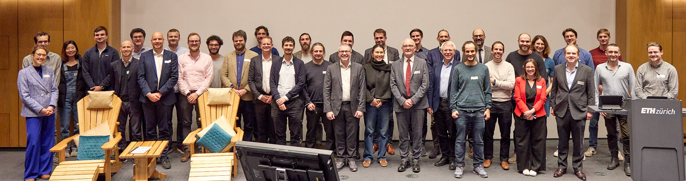

<!--  -->

## Venue

[Complexity Science Hub](https://csh.ac.at/), Palais Rothschild 
Metternichgasse 8, 1030 Vienna, Austria 
[Link to map](https://maps.app.goo.gl/hdg5cN2e7vnqJsZ5A)

<!--
<a href="https://www.sg.ethz.ch/final-workshop-form/" style="display: inline-block; padding: 8px 16px; font-size: 16px; font-weight: bold; color: white; background-color: #581616; border-radius: 5px; text-decoration: none; transition: transform 0.2s;">
  Register Here
</a>

-->

## Synopsis

Agentic artificial intelligence, better known as AI Swarms, has advanced to an incredible level of independency, reasoning, and coordination.
This raises fears about their malicious capabilities, e.g. influencing public votes, manipulating online discussions, organizing political campaigns or inciting violence.

To better understand and predict their collective behaviour needs a joint scientific effort.
We can build on recent advances in different disciplines, but need to unite their contributions for a comprehensive understanding of AI swarms.

The collective behavior of AI swarms can both lead to malicious uses but also to unintended consequences in benign applications where systemic risk can emerge.
The availability of AI agents for experimentation and
benchmarking is a unique opportunity to inform Complexity
Science approaches that can explain swarm behavior and
motivate interventions and policies.

* Understanding: To what extent can LLM based multi-agent
systems exhibit swarm behavior? 

* Interventions: How can malicious AI swarms be
detected, steered or disrupted? 

* Methodologies: How can we empirically understand the
  individual and collective behavior of AI agents?

## Participants 

* Bail, Christopher	(Duke U), USA
* Baronchelli, Andrea (City U London), UK
* Eisenberger, Iris (Vienna), Austria
* Evans, James	(U. Chicago), USA
* Galesic, Mirta (CSH Vienna), Austria
* Garcia, David (U Konstanz), Germany

* Hamann, Heiko (U Konstanz), Germany
* Hayes, Abigail (U Mannheim), Germany

* Lorenz-Spreen, Philipp (MPI Berlin), Germany
* de Marzo, Giordano (U Konstanz), Germany
* Kunst, Jonas	(Norwegian Business School), Norway
* Olsson, Henrik (CSH Vienna), Austria
* Prieto-Curiel, Rafael (CSH Vienna), Austria
* Scholtes, Ingo (U Würzburg), Germany
* Schroeder,  Daniel Thilo	(SINTEF Oslo), Norway
* Schweitzer, Frank (ETH Zürich), Switzerland
* Strohmaier, Markus (U Mannheim), Germany
* Thurner, Stefan (CSH Vienna), Austria
* West, Robert (EPFL Lausanne), Switzerland

## Organisation

- [Prof. David Garcia, Department of Politics and Public Administration, University of Konstanz](https://dgarcia.eu/curriculum-vitae/)
- [Prof. Ingo Scholtes,  Center for Artificial Intelligence
  and Data Science, Universität of Würzburg](https://www.ingoscholtes.net/)
- [Prof.em. Frank Schweitzer, Former Chair of Systems
  Design, ETH Zürich](https://www.sg.ethz.ch/)

<!--

## Downloads 

- [Program with Abstracts (PDF)](SG-Final-Symposium-Program.pdf)
	
- [Photo Gallery](/uploads/gallery.html)

- [Presentation Slides: Click on "See Abstract" for Each Talk]()
	
- [Videos: Making of the Chair](/talks/2024_final_workshop_october/z_making-of-the-chair/)

- [Videoaufzeichnung: Abschiedsvorlesung](/talks/2024_final_workshop_october/5-0-schweitzer/)

- [Presentation Slides: Abschiedsvorlesung](/presentations/Schweitzer-Slides.html)
-->
