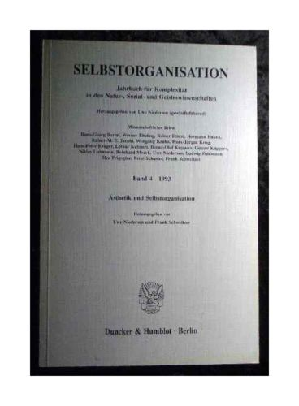

### **Brownian Agents and Active Particles. On the Emergence of Complex Behavior in the Natural and Social Sciences**

Frank Schweitzer,
Foreword by J. Doyne Farmer,
Berlin: Springer (Springer Series in Synergetics), 2003, 420 pp. 192 illus. (ISBN 3-540-43938-2)
[more details](/team/frank_schweitzer/until2005/agentbook-iv.html)

---

### Modeling Complexity in Economic and Social Systems

Frank Schweitzer (ed.)
Singapore: World Scientific, 2002, 395 pp. (ISBN 981-238-034-5)
[more details]((/team/frank_schweitzer/until2005/wsbook.html))

---

### Evolution und Selbstorganisation in der Ökonomie/Evolution and Self-Organization in Economics

Frank Schweitzer, Gerald Silverberg (Hrsg.)
*[(Selbstorganisation. Jahrbuch für Komplexität in den Natur- Sozial- und Geisteswissenschaften](/admin/page/page/17/team/frank_schweitzer/until2005/jaso-edit.html), Bd. 9)*
Berlin: Duncker & Humblot, 1998, 488 S. (ISBN 3-428-09608-8)
[more details](](/team/frank_schweitzer/until2005/econ-iv.html))

---

### Komplexe Strukturen: Entropie und Information

Werner Ebeling, Jan Freund, Frank Schweitzer
Stuttgart: Teubner, 1998, 268 S., 53 Abb. (ISBN 3-8154-3032-1)
[more details](](/team/frank_schweitzer/until2005/teubn-iv.html))

---

### Self-Organization of Complex Structures: From Individual to Collective Dynamics

Frank Schweitzer (ed.)
Foreword by Hermann Haken

- **part 1:** *Evolution of Complexity and Evolutionary Optimization*
- **part 2:** *Biological and Ecological Dynamcis, Socio-Economic Processes, Urban Structure Formation and Traffic Dynamics*

London: Gordon and Breach, 1997, 596+xxiv pp. (ISBN 90-5699-027-6)
[more details](/team/frank_schweitzer/until2005/gb-iv.html)

---

### Ästhetik und Selbstorganisation

Uwe Niedersen, Frank Schweitzer (Hrsg.)
[Ästhetik und Selbstorganisation](/team/frank_schweitzer/until2005/jaso-iv.html)
[(Selbstorganisation. Jahrbuch für Komplexität in den Natur- Sozial- und Geisteswissenschaften](/team/frank_schweitzer/until2005/jaso-edit.html), Bd. 4)
Berlin: Duncker &amp; Humblot, 1993, 311 S. (ISBN 3-428-07813-6)
[more details](/team/frank_schweitzer/until2005/jaso-iv.html)

---

### Thermodynamics of Finite Systems and the Kinetics of First-Order Phase Transitions

Heinz Ulbricht, Jürn Schmelzer, Reinhard Mahnke, Frank Schweitzer
Leipzig: Teubner, 1988, 220 pp., 111 Figs. (ISBN 3-322-00491-0)
[more details](/team/frank_schweitzer/until2005/thdyn-iv.html)

---

## Special Issues of Scientific Journals

- [Applications of Celullar Automata in Complex Systems](http:/econpapers.repec.org/article/wsiacsxxx/default05.htm)
  **Special Issue of**
  *Advances in Complex Systems (ACS)*(2002)
  *Guest Editor:*Frank Schweitzer

- [**Complex Dynamics in Economics**](/team/frank_schweitzer/until2005/contents-acs.new.html)
  **Special Issue of**
	*Advances in Complex Systems (ACS)*(2001)
	*Guest Editors: Frank Schweitzer, Dirk Helbing*

- [**Economic Dynamics from the Physics Point of View**](/team/frank_schweitzer/until2005/contents-physa.html)
  **Special Issue of**
  *Physica A*(2000)
  *Guest Editors:*Frank Schweitzer, Dirk Helbing
