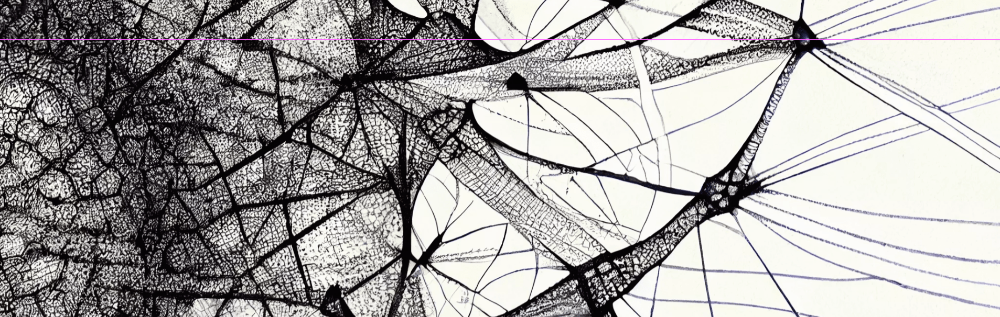

# SG Symposium: The Complex Network Approach to Data Science

<table class="seminar">
  <tr>
    <td width="25%"></td>
    <td><table class='seminar_inner'>
    <tr><td><small><i>09:15 — 10:00</i></small></td></tr>
    <tr><td>Disentangling homophily, community structure and triadic closure in networks</td></tr>
    <tr><td><b>Tiago Peixoto</b></td></tr>
    <tr><td><small><i>Department of Network and Data Science, CEU, Vienna</i></small></td></tr>
    </table></td>
  </tr>
  <tr>
    <td></td>
    <td><table class='seminar_inner'>
    <tr><td><small><i>10:00 — 10:45</i></small></td></tr>
    <tr><td>Data Science on Knowledge Graphs
    </td></tr>
    <tr><td><b>Giona Casiraghi</b></td></tr>
    <tr><td><small><i>Chair of Systems Design, ETH Zürich</i></small></td></tr>
    </table></td>
  </tr>
  <tr>
  <td><i>10:45 — 11:15</i></td>
  <td><b>Coffee Break</b></td>
  </tr>
  <tr>
    <td></td>
    <td><table class='seminar_inner'>
    <tr><td><small><i>11:15 — 12:00</i></small></td></tr>
    <tr><td>De Bruijn Goes Neural: Towards Causality-Aware Graph Neural Networks for Time Series Data</td></tr>
    <tr><td><b>Ingo Scholtes</b></td></tr>
    <tr><td><small><i>CAIDAS, Julius-Maximilians-Universität Würzburg</i></small></td></tr>
    </table></td>
  </tr>
</table>

---
### 09:15 – 10:00: Disentangling homophily, community structure and triadic closure in networks

<figure class="card card__row2">
    <!-- <a href="http://localhost:1313/team/frank_schweitzer/"> -->
    

<h3>Tiago Peixoto</h3>

<small>Department of Network and Data Science, CEU, Vienna</small>

</a>
</figure>
