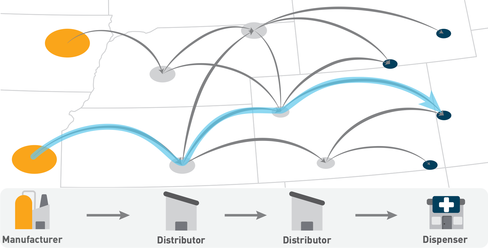

Excited to share our research published in *Science Advances*, focusing on a vital aspect of modern logistics: pharmaceutical supply chain resilience ([Link to Paper](https://doi.org/10.1126/sciadv.adj1194) 📑).

The COVID-19 pandemic and subsequent global events have underscored the critical need to enhance supply chain resilience. To address this challenge, our study introduces the concept of 'reroute flexibility,' best understood through an analogy to a road network.

Picture a distribution network for products as a network of roads and intersections.
The distribution paths—routes products take to their destinations—are like journeys on these roads.  During disruptions, one might consider building new roads to improve flow, but this is obviously too slow, prehitively expensive and overall wasteful. A much better solution is for the driver or navigation system to use other, possible but never before used roads to reach the destination.

> **Figure 1:** Schematic illustration of a distribution network, emphasizing its geographic spread and complex structure. Goods are shipped from manufacturers to their destinations via pathways (highlighted in blue). Note that not all possible pathways are used; only a small subset is. Our paper demonstrates how utilizing underutilized but existing distribution pathways can mitigate shortages.

 

We explore this concept within a pharmaceutical distribution system, viewing distribution centers as nodes and the connections between them as links. Our research focuses on learning typical distribution patterns to assess how existing connections between distributors can be repurposed. We define 'reroute flexibility' as the ability to use existing links to follow new distribution paths, akin to a driver taking a detour along the existing road network when encountering unexpected congestion.

'Reroute flexibility' is a metric we've developed to measures the potential for a given distribution system to use these alternative paths, maintaining the flow of goods by rerouting along pre-existing but underutilized paths, rather than establishing new business relations.

Our findings, leveraging a decades worth of pharmaceutical shipment records show that effectively leveraging reroute flexibility can delay the onset of critical shortages. This approach not only enhances resilience but also avoids the costs and complexities associated with establishing new business relations.

This innovative framework can seamlessly integrate with existing pharmaceutical tracking systems, like the European Medicines Verification System (EMVS), offering real-time insights for decision-makers.

Beyond pharmaceuticals, the principles of our framework apply to various other sectors, providing a versatile tool for managing complex supply chains in the face of global disruptions.

If you are interested in learning more about our research on resilience go to our [Resilience page](/projects/resilience).

**Authors**: [Ambra Amico](/team/ambra_amico), [Luca Verginer](/team/luca_verginer), [Giacomo Vaccario](/team/giacomo_vaccario), [Giona Casiraghi](/team/giona_casiraghi) and [Frank Schweitzer](/team/frank_schweitzer)

