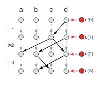

Our paper [Higher-order models capture changes in controllability of temporal networks](https://iopscience.iop.org/article/10.1088/2632-072X/abcc05) has been accepted to be published in [Journal of Physics: Complexity](https://iopscience.iop.org/journal/2632-072X)

