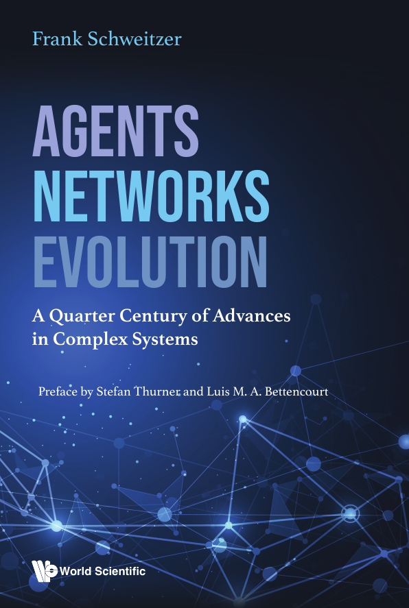

<!-- Write your content here -->

### Agents, Networks, Evolution: A Quarter Century of Advances in Complex Systems

**From the preface by  Stefan Thurner and Luís M. A. Bettencourt --** 

"All four parts start with an overview of the topical areas.
These insightful introductions make the book more accessible to non-experts, a fact that should help to spread recent developments in complexity science also to a younger audience and scientists outside the field. Experts will enjoy (re-)reading the contributions of a selected crowd of renown complexity scientists. Finally, the book takes an explicit focus on a number of concrete applications in different scientific areas, which makes it particularly attractive. " 

**Free download: https://doi.org/10.1142/13184** 
