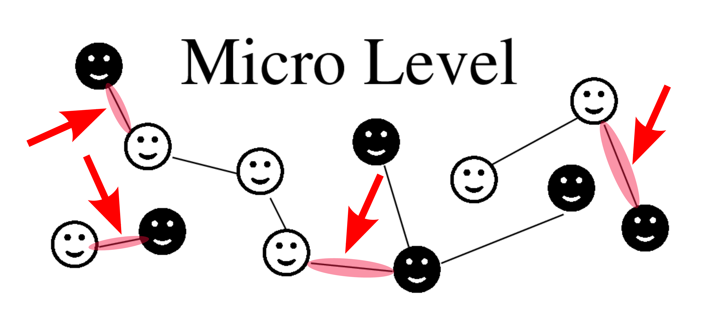

<!-- Write your content here -->

Two short texts for the general audience explain the problems of systems design in complex systems: 

[Designing Systems Bottom Up: Facets and Problems](/publications/2020/schweitzer2020designing-systems-bottom)

[The Bigger Picture: Complexity Meets Systems Design](/publications/2019/schweitzer2019the-bigger-picture)
