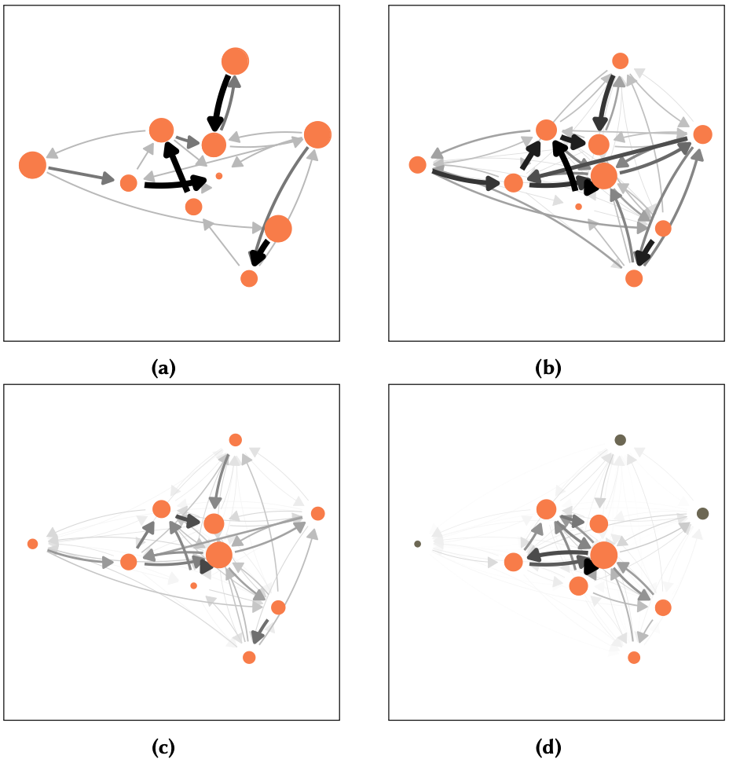

In this article, we study the lock-in effect in a network of task assignments.
Agents have a heterogeneous fitness for solving tasks and can redistribute unfinished tasks to other agents.
They learn over time to whom to reassign tasks and preferably choose agents with higher fitness.
A lock-in occurs if reassignments can no longer adapt. Agents overwhelmed with tasks then fail, leading to failure cascades.
We find that the probability for lock-ins and systemic failures increase with the heterogeneity in fitness values.
To study this dependence, we use the Shannon entropy of the network of task assignments.
A detailed discussion links our findings to the problem of resilience and observations in social systems.
[Get the preprint here.](https://www.sg.ethz.ch/publications/2021/casiraghi2021downside-heterogeneity/)

