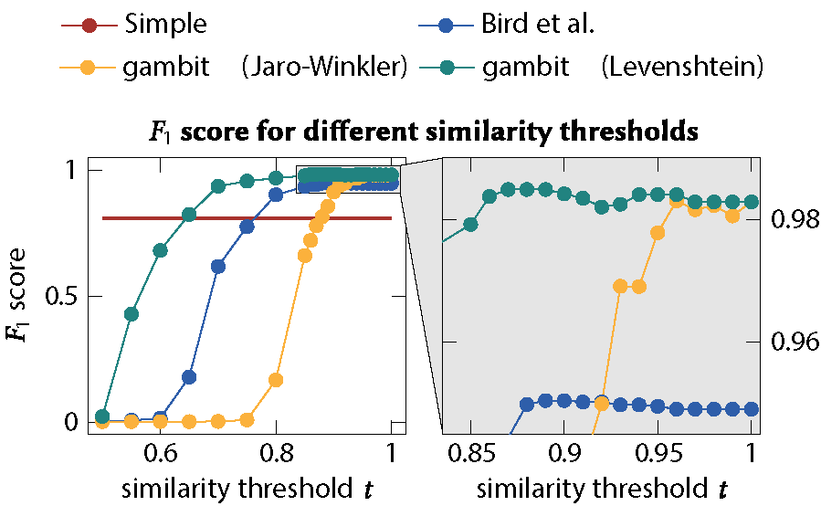

We are excited to announce that our paper [gambit - An Open Source Name Disambiguation Tool for Version Control Systems](https://arxiv.org/abs/2103.05666) has been accepted at MSR 2021. 

The ease of creating user accounts online results in single individuals appearing under multiple aliases.
If these ambiguities are not adequately resolved, subsequent studies can be significantly biased.
gambit enables researches to disambiguate an individual's different aliases to a unique identifier and therefore represents an essential first step in any study analysing real-world user data.

gambit is available as Open Source Python package via PyPI  `pip install gambit-disambig` and on [GitHub](https://github.com/gotec/gambit).
A preprint is now available on [arXiv.org](https://arxiv.org/abs/2103.05666).

