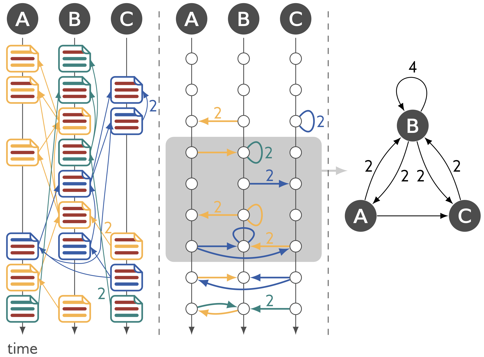

A git repository tracks all changes made to a set of files by an individual or a team of users. Being the most popular version control system, git’s applications range from the collaboration on scientific publications and joint collections of code snippets to fully-featured coding schools and popular software projects such as Linux or Firefox. Analysing the consecutive changes tracked in a git repository allows us to study the creation of the abovementioned artifacts in unprecedented detail. This helps practitioners identify bottlenecks in their own projects. In addition, as many git repositories, e.g., those of Open Source software projects, are freely accessible, git repositories represent a rich source of social network data capturing interactions in collaborative social systems.

Participants of our tutorial will learn how to mine fine-grained social networks from any git repository using git2net. git2net is an Open Source Python package that facilitates the extraction of multiple types of social networks from git repositories., e.g., co-editing networks that capture individuals that consecutively edit the same line of code. 

The tutorial material, together with installation instructions and a full documentation for git2net already freely available here: [git2net.readthedocs.io](https://git2net.readthedocs.io/en/latest/).

