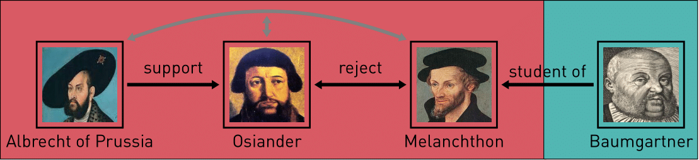

Ramona Roller presents how to treat time in a letter correspondence network of the Reformation.

The Reformation is characterised by frequent letter correspondences between scholars which can be modeled as a network.
Letters have sending dates, providing a temporal order for the spread of ideas and routes of influence. This temporal order of letters affects network measures and therefore has to be considered in network analyses. I show how to address this challenge by using *pathpy* a software to analyse temporal networks.

The [lunch lecture series](https://historicalnetworkresearch.org/hnr-events/hnr-lunch-lectures/) of the Historical Network Research community addresses network analyses for historical networks.

