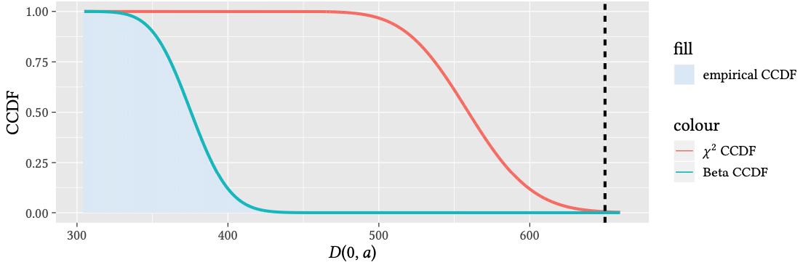

<!-- Write your content here -->
Did you know that Wilk's theorem does not hold for multi-edge network models?

In our newest preprint, we show how to correct the null-distribution of the likelihood-ratio test when working with complex network data.
Check out the paper [here](/publications/2021/casiraghi2021the-likelihoodratio-test/).