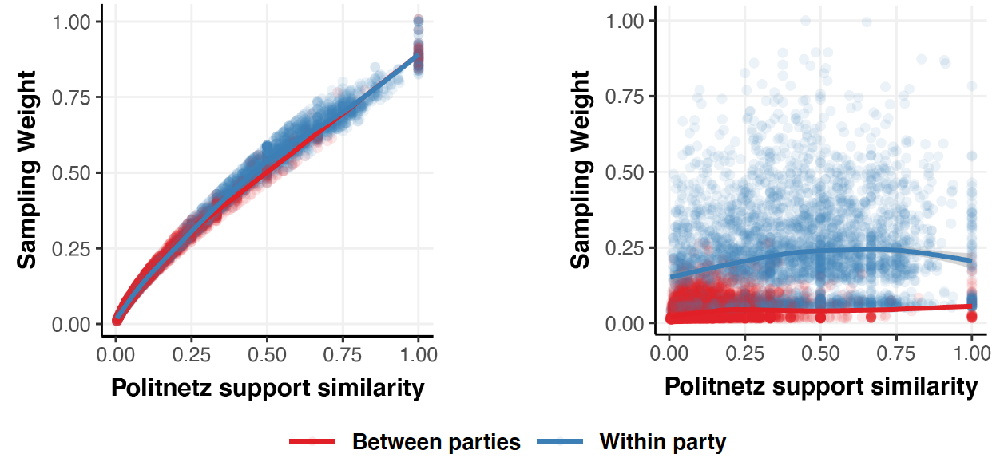

Are offline political relations and endorsements established or maintained with online interactions? We examine the external validity of data on political behavior exhibited online and compare it to offline behavior.  We overlay two data sets on political support among members of the Swiss parliament to estimate the explanatory power of online endorsements on offline cosponsorship signatures among members, using a gHypEG network regression model. Whereas offline support behavior is driven by a broad range of factors, such as network and homophily effects, online endorsement is less diverse. Our findings show that online endorsement is predominantly driven by partisanship, calling into question the use of online political behavior data to study real-world politics.

Interested? Check out our [preprint](https://osf.io/preprints/socarxiv/j4fp6/)!
