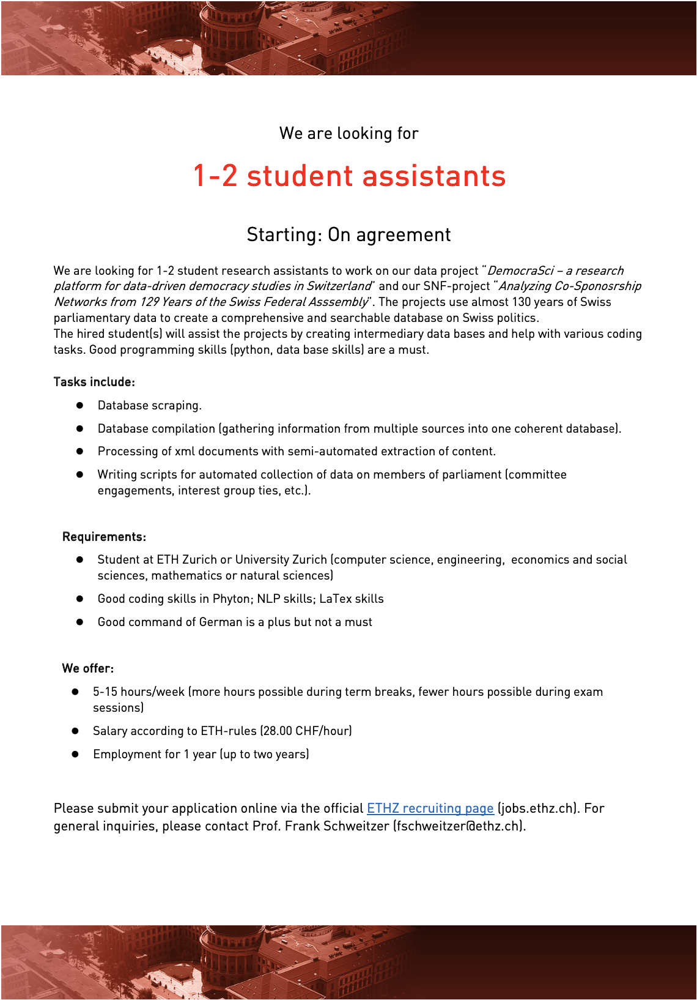

We are looking for 1-2 student research assistants to work on our data project "DemocraSci – a research platform for data-driven democracy studies in Switzerland" and our SNF-project. The projects use almost 130 years of Swiss parliamentary data to create a comprehensive and searchable database on Swiss politics.
The hired student(s) will assist the projects by creating intermediary data bases and various coding tasks. Good programming skills (python, database skills) are a must.

Check out the complete job description on the official [ETHZ recuriting page](https://www.jobs.ethz.ch/job/view/JOPG_ethz_frvDyiyqP9a8NfqsoT). 

