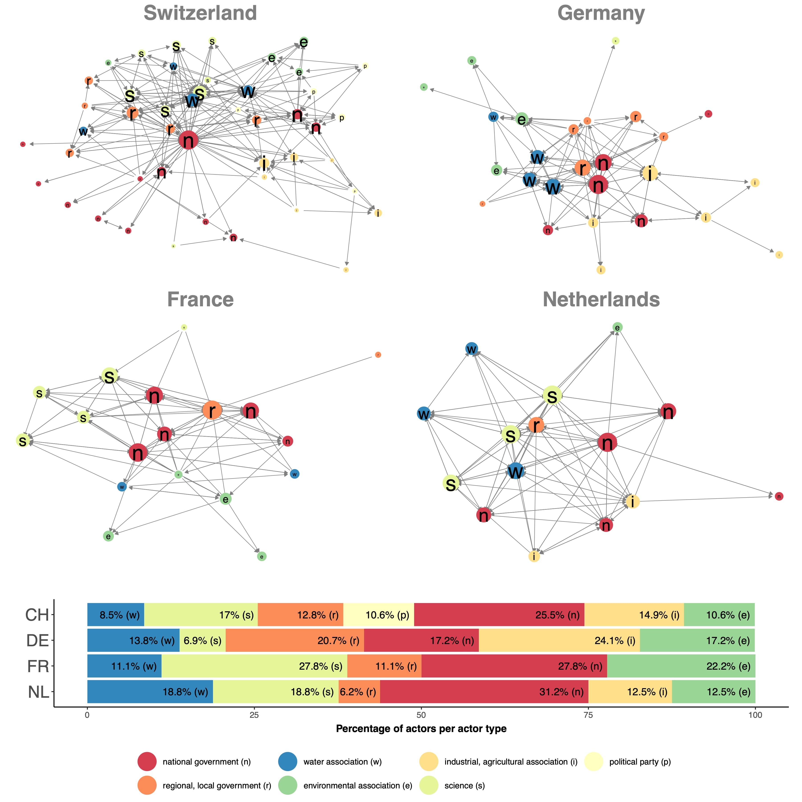

New publication in the American Journal of Political Science is out. Check it out [here](https://onlinelibrary.wiley.com/doi/10.1111/ajps.12699).

# Research question

The link between political systems and the structure of policy networks has received little attention in the policy studies literature.
But the way the political system is set up can have deep impacts on how actors embedded in it engage with each other.
In this article we examine power structures and interaction patterns between policy actors. 

We look at four different networks: 

* the German and Swiss policy networks embedded in the *consensual–federal* democracies
* French policy network embedded in a *majoritarian–unitary* democracy
* and the Dutch policy network embedded in a *consensual–unitary* democracy.

How do the four policy networks differ in terms of power structures and interaction patterns?

# Why should the political system affect political network structures?

Policy networks are a way of depicting the policymaking process. 
In the policymaking process, actors come together to generate, update or implement policies that shape our daily lives. As this process takes a long time, relations among actors start to form and shape the policy outcomes.
The political system can be thought of as laying the groundwork for these interactions and collaborations to foster. Formal and informal institutions shape the *power structure and interaction patterns* among these policy actors and thus are reflected in the structure of the network.

In the article, we hypothesize that the concentration of power as well as the level of competition among actors is related to the political systems the network is embedded in: 

* Hypothesis 1: Diffusion of power is stronger in ideal–typical consensus democracies (compared to majoritarian).
* Hypothesis 2: Close-knit and cooperative interactions are more common in ideal–typical consensus democracies (compared to majoritarian).

# Data and Method

We test our hypothesis on four policy networks. We questioned 149 state and non-state policy actors involved in policy processes related to water pollution. Response rates differed across the four networks and was highest in Switzerland (89\%), then Germany (68\%), then Netherlands (51\%) and was lowest in France (46\%). The survey included questions on collaboration ties, ally-opponent ties and policy beliefs.

To compare the structure of the policy networks, we employ Exponential Random Graph Models. To ensure we can compare the results across the four policy networks, we use micro-level interpretations of ERGMs and calculate predicted probabilities of collaboration ties. This step is necessary because the four networks have differing number of actors and different densities. Since we want to explore exactly these differences in the network structure, the comparison of ERGM coefficients (as is often done in the literature) leads to wrong conclusions. Only by using predicted probabilities and adjusting for different baseline probabilities can the network structures be compared soundly.

# Results

Our results indicate that in the French and Dutch systems (majoritarian and hybrid), popularity effects are much more pronounced. This indicates that in these networks, power is much more concentrated. 

Furthermore, we find that the Swiss, German and French network have strong tendencies to form triads, i.e., close-knit collaborations among the actors. Looking into the quality of these connections, we find that in the Swiss and German case, collaborations tend to span across political divides. This indicates that in the consensual–federal systems, actors collaborate with their opponents. Furthermore, in the French network, actors tend to collaborate more with actors with whom they share similar beliefs. In the German and Swiss network, we find collaborations across these political divides (again pointing to the consensual nature of the system).

``In summary, political systems provide opportunity structures for the emergence of specific patterns of ties in policy networks.'' (p. 14)

# Future research

This paper is one of few who compare network structures across different countries (or political systems). This makes sense for two reasons: 1) Data collection of policy networks is resource-intense work. Doing so across different countries even more so. Especially, since the surveys need to be aligned so that the measures are the same across the cases. 2) Methodologically, it is difficult to compare network structures across networks without remaining superficial (e.g., looking at different density levels) or drawing the wrong conclusions (e.g., by comparing coefficient sizes from inferential network models without standardizing them in a meaningful way).

However, there are hopeful signs that these difficulties are slowly eroding and we look forward to many more studies comparing power concentration and interaction patterns across political systems to corroborate our findings.

