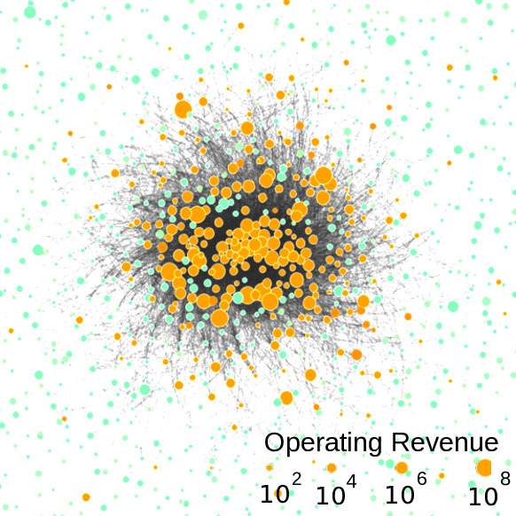

The reputation of firms is largely channeled through their ownership structure. We use this relation to determine reputation spillovers between transnational companies and their participated companies in an ownership network core of 1318 firms. We then apply concepts of network controllability to identify minimum sets of driver nodes (MDS) of 314 firms in this network. See our paper [here](https://www.sg.ethz.ch/media/publication_files/2101.05010.pdf).

