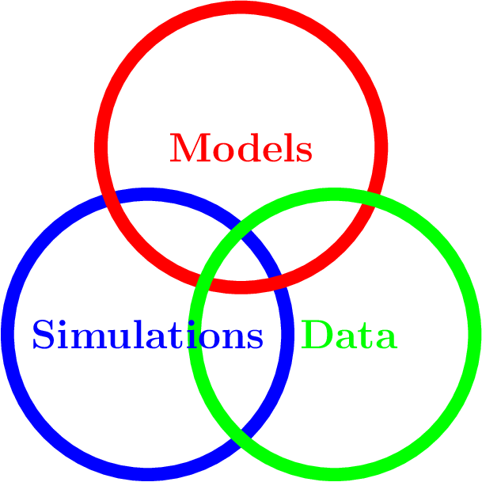

<!-- Write your content here -->

### How we do it - Frank Schweitzer on the challenges of interdisciplinary research

**Broad, not narrow --** 
At the Chair of Systems Design we conduct truly inter-disciplinary research. It combines insights from computational science, applied mathematics, biology, economics, social science and statistical physics to model complex socio-economic systems.

Two illustrative  examples: We have studied the R&D (research and develompment) collaboration network of about 15.000 firms from different industrial sectors to understand knowledge transfer and success. Also, we studied the productivity of hundreds of software developer teams, to identify their coordination overhead. 

**Science, not engineering --**
The first question is always about applications of our research. 
Instead of products, we develop scientific insights, for example into the mechanisms of collective social
behavior. Take our research on emotional influence, something  everyone has experienced for herself.
But how should emotional influence be quantified? What is its impact on decisions? How do collective emotions emerge from individual interactions? To answer such questions, 
we developed the first multi-agent
model of emotional influence that is calibrated against physiological measurements and text 
based sentiment analysis.
This allowed us to model collective emotions of users in online social media, for instance in chatrooms and in product review communities. 

**Problems, not methods --**
The motto of our team: We don't sell methods, we solve scientific problems.
This first requires to *understand* our systems of investigation, which takes time and effort. 
It is important to keep a high scientific curiosity and to discuss scientific problems from different perspectives. 

**Bridging, not avoiding the gap --**
In interdisciplinary projects, 
communication is key and respect for other scientific approaches, too.
The major challenge we experience is the disciplinary gap. To exchange ideas, everyone has to brigde that gap and we practice it.  For instance, to develop a social network model of a bat colony, *we* need to understand how bats make decisions, and our *partners* need to understand the results of our statistical network analysis. 

This requires considerable effort, in particular when publishing together. 
Most of our publications are well received, albeit after a tremendous amount of work. 
Disciplinary-specific journals require us to narrow down the scope of our work.
Often we choose general purpose journals, such as PNAS, Scientific Reports, or Advances in Complex Systems,  because of their broarder research scope. 

**Is it worth the effort? --** 
My interdisciplinary research has definitely contributed to my career. 
I was trained as a physicist and ended up as a professor of systems design in a department of management and economics. That would not have been possible without a strong interdisciplinary profile. Yet, it took more time and effort to develop and did not make it easier for me to establish myself in academia. Sometimes it seems that a narrow disciplinary profile gives better chances of success. But I have never adjusted my research interests to fit other's expectations. 

**My advice for young researchers --**
There is not one, but a few:

- Develop solid methodological skills in mathematics, data science, programming. These help in all interdisciplinary projects. 

- Test and prove your curiosity for different scientific disciplines. That is the best way to find out whether you really want to cross scientific boarders. 

- Invest in your communication skills, to understand and to reach out to scientists from different disciplines. Build a social network across disciplines. 

- Develop your personality: Confidence should be combined with the ability to questioning your own approach. Be patient with yourself and with academia. Make your motivation for interdisciplinary  research not dependent on quick success. 

