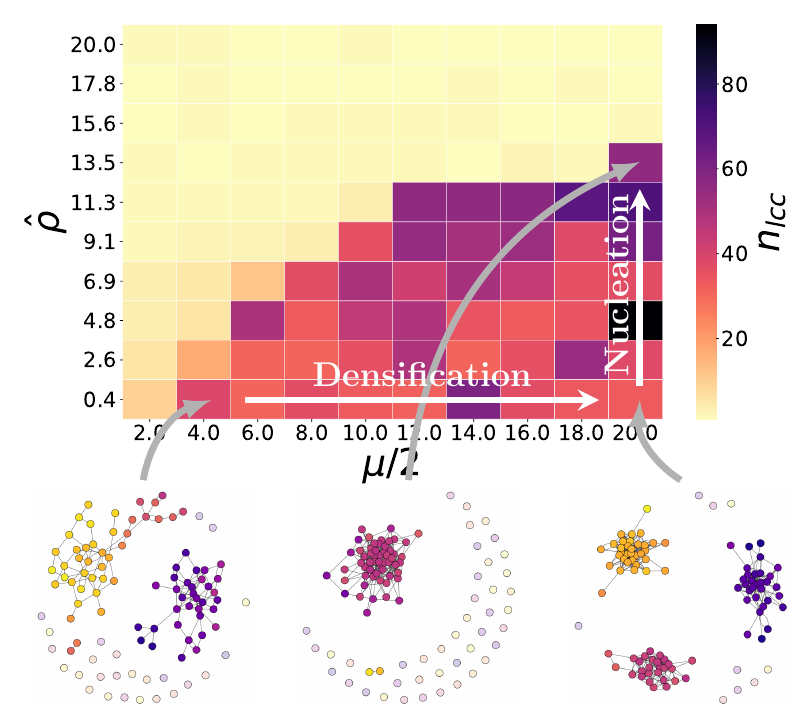

<!-- Write your content here -->

What is the physics in sociophysics? Two new publications explore the relation: 

- [Social percolation revisited: From 2d lattices to adaptive networks](/publications/2021/schweitzer2020social-percolation-revisited)

- [Social nucleation: Group formation as a phase transition](/publications/2021/schweitzer2021social-nucleation-group)
