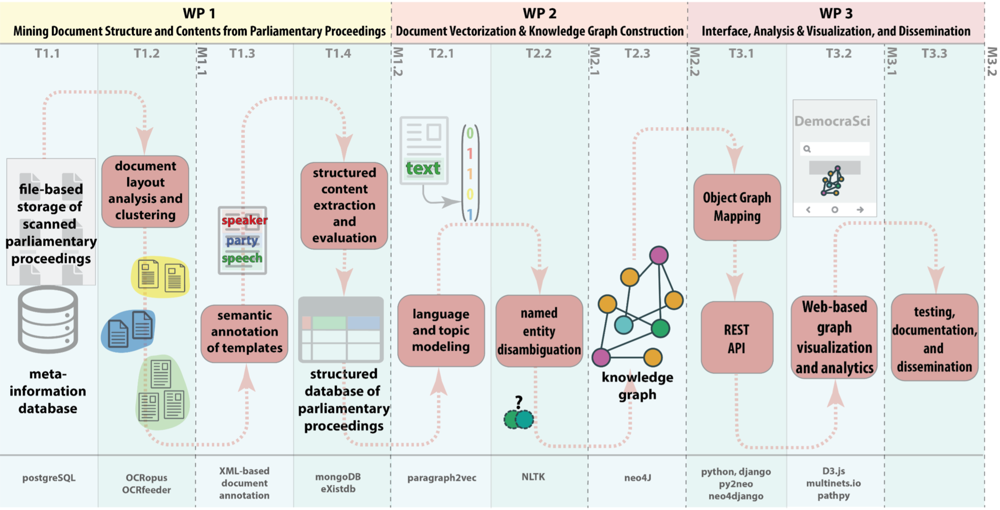

The goal of our research and data project DemocraSci is to create a searchable database of the Swiss Parliament. For the past 130 years (starting in 1891), the Swiss Parliament has carefully documented its actions and debates in the so-called Amtliches Bulletin---a stenographic record of parliamentary speeches and legislative proposals. In our project we carefully extract and structure the data from the Amtliches Bulletin. 

Our database will contain 

- all bills, legislative proposals and parliamentary questions brought forth by  members of the parliament, comittees, parliamentary groups (called Fraktionen) and cantons (in the form of a Standesinitative)
- all speeches recorded in the Amtliches Bulletin
- all members passing through the parliament as well as their functions, their committee memberships and their involvement in parliamentary affairs
- all votes and voting outcomes for proposals
- all cosponsorship signatures from members of parliament on bills

The project is a collaboration between our chair and the [Swiss Data Science Center, SDSC](https://datascience.ch). 

**Collaboration partners:** Luis Salamanca (SDSC), Fernando Perez-Cruz (SDSC)

**Project start:** fall 2019

**Project end:** 2022