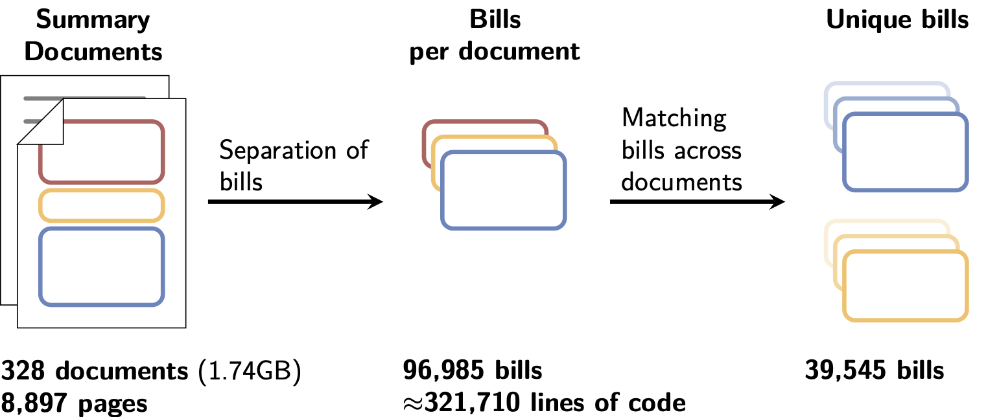
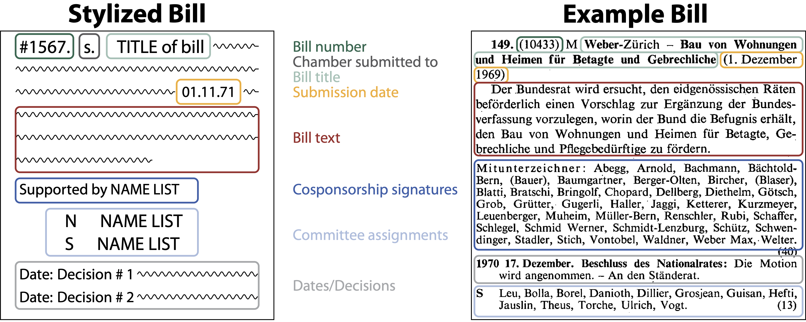
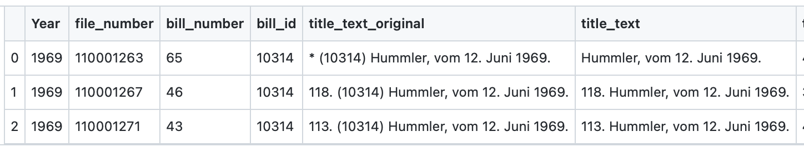

After 2.5 years of working with us on DemocraSci, Marta Balode is leaving our group. 
Marta joined our team in the spring of 2020 and throughout her Master's studies has been working tirelessly on extracting all the bills from the [Summary documents](https://www.sg.ethz.ch/news/swissparliament_4-summarydocs_part1/).
Without her work, the project would not be where it is today! 

## Parsing the summary documents

Marta parsed all summary documents from 1891-1970. She processed 8,897 pages scanned by the Federal Archives and the Parliamentary Library. 

For each document she separated all the bills and then extracted them. In total, over 95 thousand bills were recorded in the Summary Documents between 1891-1969. 

She then matched the bills throughout the years, resulting in almost 40,000 bills.

## A closer look at Marta's work

Marta was given the task of extracting all the information on bills from 1891-1970. As described in some of our earlier blogposts [here](https://www.sg.ethz.ch/news/swissparliament_4-summarydocs_part1/) and [here](https://www.sg.ethz.ch/news/swissparliament_5-summarydocs_part2/), these documents are inherently complex. For every parliamentary session (4x a year), the Amtliches Bulletin published these summary documents to list all the bills the parliamentary chambers had to work on during the session. They include legislative drafts proposed by the federal council, motions, postulate, interpellations, questions and other, more obscure bill types (such as the Begnadigungsgesuche or Eisenbahngeschäfte) in close detail.

Marta structured all the information in the PDF documents into data tables for us. She painstakingly coded rules for the extraction of information, such as submission dates of bills, their text, cosponsorship signatures etc. She also coded data checks into her extraction process and manually went over errors to ensure the data is of high quality. 

Whenever there were errors in the parsed XML-files, Marta corrected them to ensure the extracted data was as clean as possible.

## Repeated bills and how to handle them

The summary documents print all bills that the two chambers debated during the session. Since most bills are not resolved within one session, the summary documents repeatedly list the same bills. 
For instance, bill #10314, a motion by Herr Hummler submitted on June 12, 1969 was printed in 3 separate summary documents (see below).

In total, Marta matched 19,383 federal drafts and 20,162 motionen/interpellationen/postulage throughout the different documents. 

## Thanks!

We thank Marta for her wonderful work on our project. We will miss her attention to detail, her problem-solving skills and her sunny nature and congratulate her on getting her Master's! All the best for your future, Marta!
