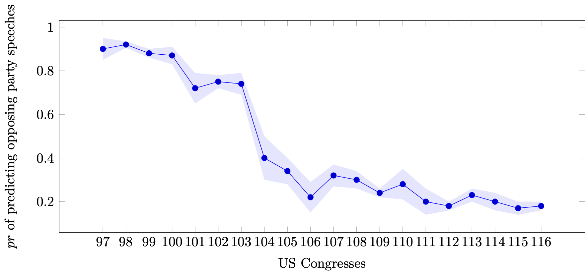

## Overview

We would like to find out if we can find evidence of polarization in politician's use of language. Do opposing party members increasingly speak out on different viewpoints and engage differently in political issues? Does their use of language increasingly differ over time? 

Along the recently published paper of Peterson and Spirling 2018, we would like to see if there is evidence of linguistic divergence in recent decades in speeches held by Democratic and Republican members of Congress.

We propose the following approach: For every Congress (97th-116th), we train a BERT-model on democratic (or republican) speeches and then try to predict the opposing party speeches (e.g., predicting a republican speech on a democratic-BERT-trained model). We expect to see increasing divergence in how well the party-specific BERT-model can predict opposing party speeches.

## Student tasks

*The student research project consists of the following tasks:*

- Disambiguate speeches for 97-110th Congress [python code exists, needs to be run on different congresses]
- Train a BERT-model for a set of speeches (e.g., democrats and republicans)
- Try to predict the opposing party speeches with the newly trained BERT-model 
- Display results of predictions across time in a time-series graph

## Requirements

*Requirements:*

This project is reserved for MTEC-students or Data Science/Computer Science Master students. Additional requirements include:

- python coding
- interest in learning how to train BERT-models
- interest in political science (or the US Congress) + polarization

The student project is 6 weeks long and the student is required to write a short (5 pages) report about the project for the grade. 

The project is co-supervised with the Swiss Data Science Center (Luis Salamanca). Please send an email to lbrandenberger@ethz.ch and russog@ethz.ch with a short CV if you're interested in this project and we'll get in contact.
(We will update this blogpost if the project is no longer available.)

----------------------
### Reference

[Peterson, A., & Spirling, A. (2018). Classification Accuracy as a Substantive Quantity of Interest: Measuring Polarization in Westminster Systems. Political Analysis, 26(1), 120-128. doi:10.1017/pan.2017.39]
