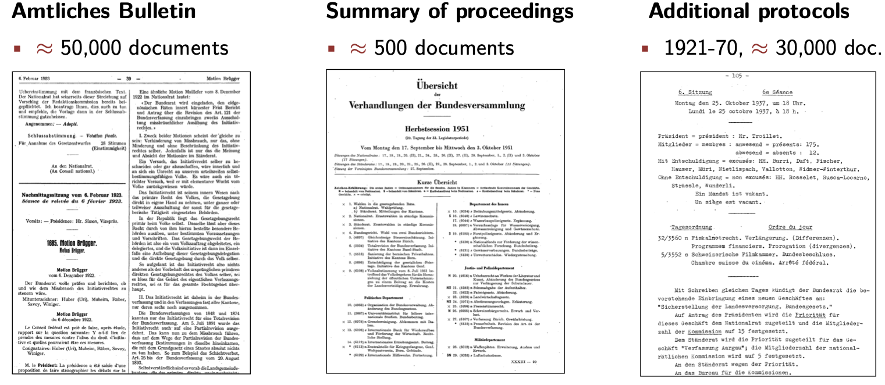

Our DemocraSci project builds on three data sources.

1. The `Amtliches Bulletin`, containing word protocols/proceedings from both chambers
2. `Summary of Proceedings`, containing an overview over all discussed/submitted bills (dt. Geschäfte)
3. `Additional Protocols`, containing additional word protocols from sessions recorded between 1921 and 1970.

The documentation of the Swiss parliamentary sessions are recorded in the `Amtliches Bulletin`.
These documentations of the sessions have undergone three mayor changes since the foundation of the Swiss Federal Assembly in 1848.
In 1891, the `Amtlichen stenographischen Bulletins` (only in 1963 did the name change to `Amtliches Bulletin` due to the staffing change and collaborations between shorthand writers (stenographers) and editors [1, page 27]) was founded to report plenary discussions in from the Swiss Federal Assembly. 
Especially for discussions surrounding bills or interventions that are subject to the referendum right, it was considered important to be open about the parliamentary discussions to inform the interested public (as documented in [1, page 11]).

The second shift came in 1920. 
The National Council decided to document all plenary discussions and not only those that were subject to a potential referendum. 
This full documentation should start in 1921 and consists of typewritten translations of stenographic protocols.
The publication of the discussions, however, remained restricted to discussions of bills that subject to the referendum right.
So, from 1921 onwards, two sources of proceedings are available: the official and published bulletin with selected discussions and the unofficial proceedings that were archived without publication (at the time) [1, pages 18-9].

A third shift came in 1970. 
Due to the increasing importance of interventions (with no referenda-option), the publication of all proceedings is considered.
Comment [1, page 28] reports that up until then, the Amtliches Bulletin only published 65% of all discussions in the National Council, and 45% of all discussions in the Council of States.
This change lead to a significant increase in the number of documents, starting 1971.
In 1972, both chambers approved (unanimously) the full publication of all proceedings and upon special request made by the Federal Council, small inquiries (dt. *einfache Anfragen*) are published in the Bulletin as well.

**[1]** Comment, Francois. 2007. Ein Blick in die Geschichte des Amtlichen Bulletins. Von 1848 bis 2007. Bern: Parlamentsdienste. Dienst für das Amtliche Bulletin der Bundesversammlung.

