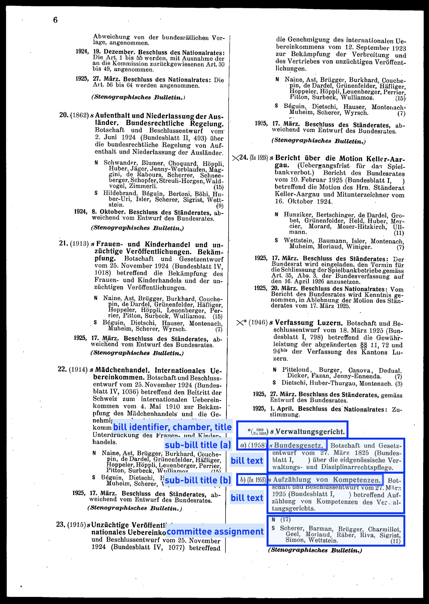

Summary documents are one of our main sources for the Project *130 Years of Swiss Parliament*. As highlighted in [Part 1 of our series on Summary Documents](https://www.sg.ethz.ch/news/swissparliament_4-summarydocs_part1/), we extract a lot of information from these documents. 
Most importantly, these documents are our baseline for the complete list of bills presented to parliament. They also include information about cosponsorship signatures, which can be used to study legislative collaborations and alliances. 

In this blogpost we talk about the numbering of bills as well as presenting some exceptions that caused us some headaches when exporting and structuring their information.

### Numbering of bills

The bills in the summary documents are numbered continuously with i) the order they take in the document and ii) the bill identifier. For new bills, i.e., bills introduced in the current session, the ordering is halted and these bills are marked with a `*`. Check out the following document as an example: Page 5 presents 3 bills (blue), followed by 4 `new` bills (green), and closes with two already introduced bills. Note the numbering is absent for newly introduced bills (green):

### Special bills

There are several bill-types that do not follow the standard structure:

* Begnadigungsgesuche
* Eisenbahngeschäfte
* Petitionen an die Bundesversammlung

These bills contain lists of items that were discussed in parliament. We have marked them for now and have not decided how to present their content in our data base. 

### Kleine Anfragen (1891-1970)

Between 1891 and 1970, the Amtliches Bulletin contains a list of a special bill called `kleine Anfrage`. These `minor inquiries`-bills are bills where members of parliament can ask questions to the Federal Council. These inquiries are also open to committees (only majorities) or parliamentary groups (dt. Fraktionen) [(click here for more information on minor inquiries)](https://www.parlament.ch/de/über-das-parlament/parlamentsportraet/beratungsgegenstaende-und-parlamentarische-verfahren/parlamentarische-initiativen-standesinitiativen-vorstoesse/anfrage). 

From 1970 onwards, these minor inquires are printed in full in the Amtliches Bulletin. Prior to that they are only presented in list form. 

### Sub-bills: 

There are also bills that inspired a range of motions or postulates submitted by members of the parliament. Prior to 1970, the Amtliches Bulletin published these bills as addendums to regular bills (see Figure below). We refer to these bills as `sub-bills` but treat them as separate bills in our data base. We explicitly link the `regular` bill with all its `sub-bills`, but sub-bills are basically stand-alone bills and we treat them as such. After 1970, the Amtliches Bulletin does the same and treats sub-bills as stand-alone bills. 

Sometimes, bills are separated into sub-bills by the Amtliches Bulletin. Often, these sub-bills get their own bill identifier. We treat these as stand-alone bills as well and relate them to each other in our data base.

