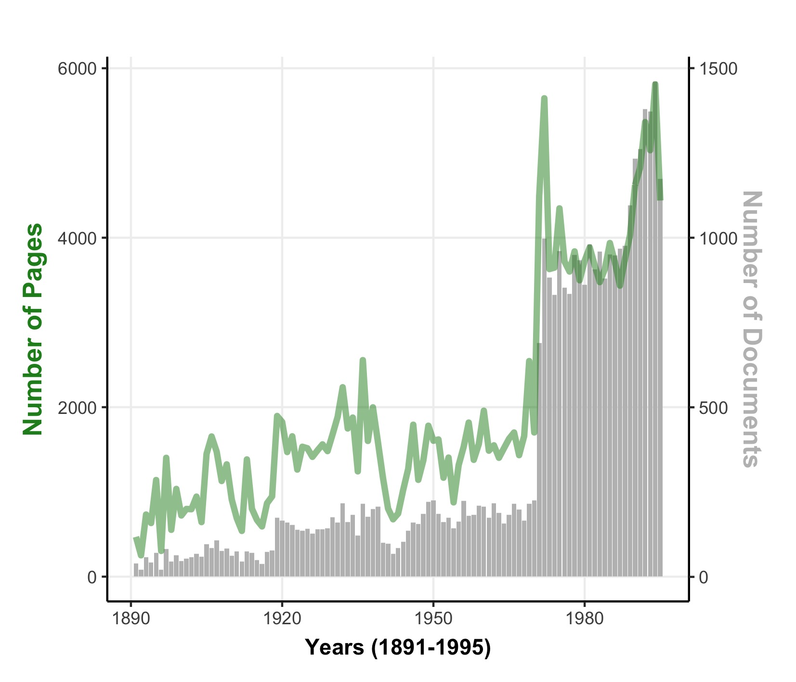

In this blogpost we give an overview over the information contained in the `Amtliches Bulletin`---our second main source of data. 

As a reminder, the records of the Swiss parliament are documented in three different types of documents (see our blogpost on this [here](https://www.sg.ethz.ch/news/swissparliament_3-datasources/)).
While the summary documents contain an overview over all discussed bills (described in detail [here (Part 1)](https://www.sg.ethz.ch/news/swissparliament_4-summarydocs_part1/) and [here (Part 2)](https://www.sg.ethz.ch/news/swissparliament_5-summarydocs_part2/)), the *Amtliches Bulletin* is our main source for parliamentary speeches and votes. 

### Let's start with some numbers

The `Amtliches Bulletin` contains all word protocols from 1891 until today. For our project, we rely on PDF scans of the printed version of the `Amtliches Bulletin` from 1891 until 1995. From 1995 onwards, the word protocols are also recorded digitally, forgoing the need to parse PDF scans.

The `Amtliches Bulletin` (1891-1995) consists of *208,788 scanned pages*. 
The pages are grouped by bill and date on which they were discussed, resulting in *35,789 documents*.

The following Figure illustrates the number of pages and documents per year:  

### What happened in 1970ies?

In the Figure, we see that in 1971 there is a huge increase in the number of documents (and pages). There's a good reason for that: In 1972, both chambers approved (unanimously) the full publication of all proceedings [1, page 28.]. Before 1970, only bills that were subject to the referendum-right were published in full in the `Amtliches Bulletin` (check out our [blogpost about this here](https://www.sg.ethz.ch/news/swissparliament_3-datasources/)). This is why, in 1971, the number of documents (and pages) drastically increases---as even the `minor requests` (kleine Anfragen) and the `questionround` (Fragestunde) are documented and printed in the `Amtliches Bulletin` from then on.

The most pages are recorded for the year 1994, with 5,810 pages, closely followed by 1972 with 5,645 pages. 
In our project we carefully process all *208,788* pages and extract a wealth of information from them.

### Information contained in the Amtliches Bulletin

The `Amtliches Bulletin` is a treasure trove of information, going fare beyond a simple records of speeches held in parliament. 
For every discussion held in the chambers, it contains: 

* the date and time of the discussion
* who presided over the discussion
* all the speeches recorded verbatim
* all proposals (dt. Anträge) or amendments proposed by committees, members of parliament or parliamentary groups
* voting records and outcomes for all the proposals as well as final votes

We'll go through these individual aspects of the Amtliches Bulletin in separate blogposts and describe how we extracted and structured their contents.

*[1]* Comment, Francois. 2007. Ein Blick in die Geschichte des Amtlichen Bulletins. Von 1848 bis 2007. Bern: Parlamentsdienste. Dienst für das Amtliche Bulletin der Bundesversammlung.

