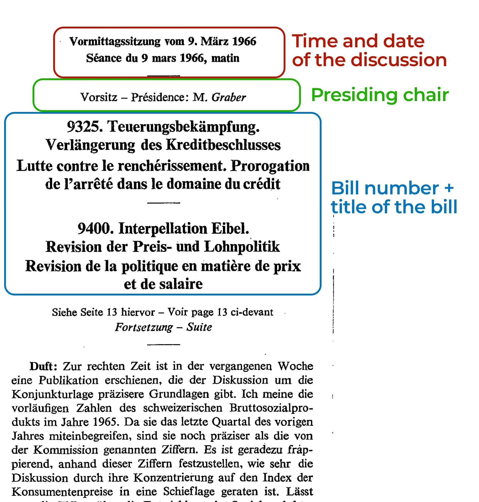
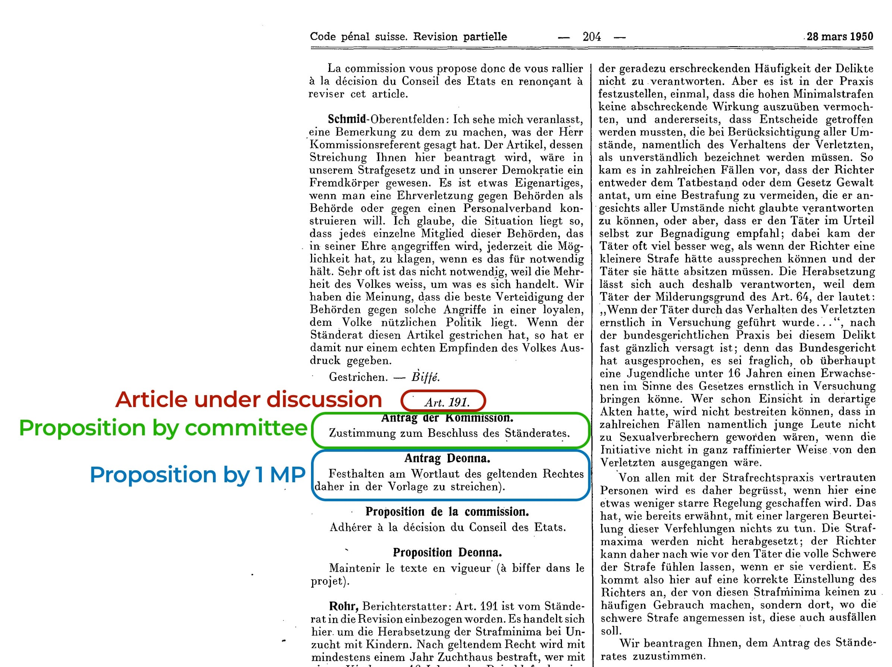
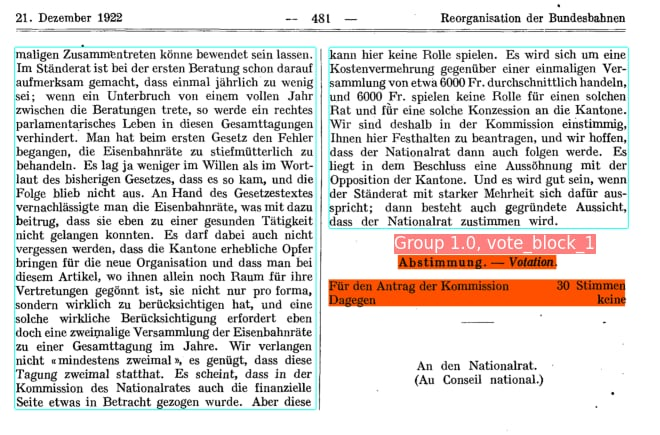
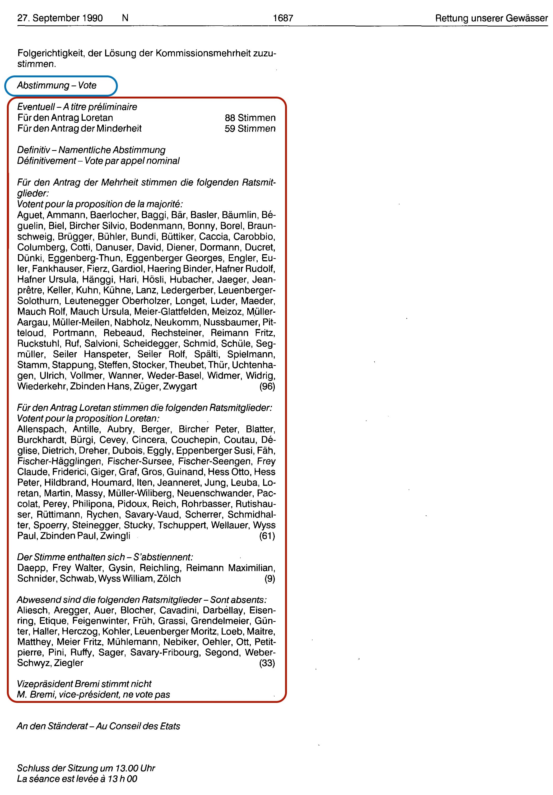
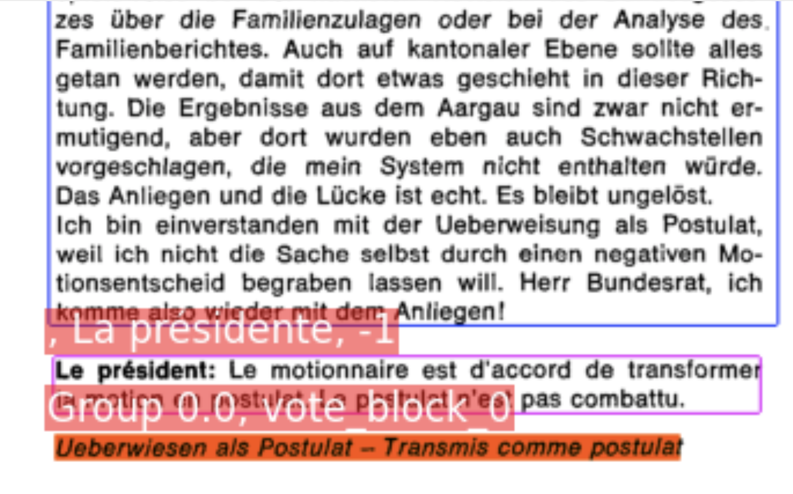

In this blogpost we go into details on the information contained in the `Amtliches Bulletin (AB)` and how we separate the different entities and label them. 
In a follow-up blogpost we explain how we separate and label the different entities with the use of a newly developed software application (designed by the SDSC and our chair).

As a reminder, the records of the Swiss parliament are documented in three different types of documents (see our blogpost on this [here](https://www.sg.ethz.ch/news/swissparliament_3-datasources/)).
While the summary documents contain an overview over all discussed bills (described in detail [here (Part 1)](https://www.sg.ethz.ch/news/swissparliament_4-summarydocs_part1/) and [here (Part 2)](https://www.sg.ethz.ch/news/swissparliament_5-summarydocs_part2/)), the *Amtliches Bulletin* is our main source for parliamentary speeches and votes. 

### Overview over what information is recorded in the AB

The `Amtliches Bulletin` is a treasure trove of information on parliamentary affairs, going fare beyond a simple records of speeches held in parliament. 
Every discussion held in the chambers is documented carefully and contains: 

* the date and time of the discussion
* who presided over the discussion
* all the speeches recorded verbatim
* all propositions (dt. Anträge) or amendments proposed by committees, members of parliament or parliamentary groups
* voting records and outcomes for all the propositions as well as final votes

### Records of dates and times

Every discussion recorded in the AB starts with a record of the time and place of the discussion, followed by the MP presiding over the discussion and the title of the bill: 

For every discussion we record the time and date as well as which discussion proceeded and follows it. This information allows us to link discussions over time: Our knowledge graph then shows either which bills were discussed one after another on specific dates OR for each bill it can list the discussions in chronological order.

### Who presides over a discussion?

For every discussion, the MP presiding over the chamber is recorded (see picture above). Presidents and vice-presidents of the two chambers often take this position and guide the discussions, call for votes and report the decisions.

Whenever the presiding chair starts to speak, the AB records the start of the discussion with "Präsident:" or "Präsidentin:", without disambiguating who exactly speaks. So this reference to the presiding chair is a reference to which person is currently in charge of the discussion and speaking.

### Records of speeches

Speeches are recorded in full and verbatim in the AB. They are recorded in the original language (mostly German and French, with some speeches held in Italian). 
Speakers are listed at the start of each speech. 

In our extraction efforts, we assign each text block a label. One of these labels are speeches. As speeches consist of a different number of text blocks per speech, there is no easy way of distinguishing when a speech starts and when it ends. There are several markers, such as the name of the speaker, in bold, starting a new paragraph. However, these markers are not universal. We, therefore, trained a supervised learning model to automatically predict which text blocks are speeches and which belong to an other entity. The biggest problem for speech-extraction are page breaks. Whenever the page breaks, it is difficult to assign the first text block of the new page to a speech or distinguish it form a text of a legislative proposition. In our efforts to extract all speeches without errors, our model reached an accuracy of 95%, i.e., 95% of all speeches are correctly identified (even if they span several pages) (see forthcoming paper on our processing pipeline).

The following image shows two pages from the AB, printed in 1950 with speeches pertaining to a penal code revision: 

First, MP Rohr, a speaker of the committee in charge of the bill starts speaking. Afterwards, MP Perrin takes over, followed by a speech by Mr. Vincent and Mr. Grendelmeier. 
The names in bold clearly distinguish between the different speeches, allowing us to extract these 4 individual speeches and assign them to the speaker.

Note that some of the speakers have roles assigned to them. The first speaker in the example above, for instance, is a representative of the committee and summarizes the committee's standpoint on the bill at hand.

### Records of legislative propositions

One of the biggest challenges for our extraction of the AB pose legislative propositions. The AB does not simply record speeches held in parliament. It also records propositions for amendments to texts made by committees (majority, minority or singular MPs or in rare cases he federal council) to the chamber discussing a bill. While these propositions are possible for a few bill types, they are most common for proposals for federal enactments (dt. Erlassentwürfe). 

Here's an example: 

From 1891 until 1917, legislative propositions were recorded in a different format. Instead of listing them in between speeches and votes, they were listed as two-column texts, with the left-hand column marking the original text and the right hand column marking the changes. 
From 1917 onwards, the AB changed format and recorded these propositions without the original text (as seen above).

There are different types of propositions. If a committee makes a proposition, this is reported to the plenary with the words: `Antrag der Kommission`. If the committee is split on what to do, they can propose majority/minority propositions. They are labeled as `Antrag der Mehrheit` and `Antrag der Minderheit`. If one (or multiple) MP(s) proposes changes, the name(s) are recorded with `Antrag NAME`.

We extract all of these propositions (in German and French, as shown above) and will match them to the committee in charge (the MPs proposing them). In our extraction efforts, we reached an f1-score of around 0.87, indicating that about 87% of all legislative propositions are extracted correctly. The biggest issues when identifying these blocks is separating them from speeches (especially if the propositions contain long text paragraphs) or making sure no other entity is wrongfully attributed to parts of the text. 

We will need to invest additional work hours to create a clean database of legislative propositions.

### Voting records

The third main entity we extract from the AB are records of votes and decisions (along with final votes, dt. Schlussabstimmungen).
Voting records differ by bill type and chamber. Often, only the final decision is reported in the AB. Sometimes with details of how many MPs voted in favor or against a proposition, sometimes just relaying the final outcome (i.e., `angenommen`).

Until 1994, voting in the National Council was done by standing up and thus only the final outcome were relayed in the AB. 
Only 30 or more MPs called made a request, did voting proceed via roll-call.

Here's an example of a roll-call vote, recorded in the AB:

Apart from these types of voting records, we also extract smaller votes/decisions: 

