Let's have a closer look at how voting records are reported for the Swiss parliament. Since our DemocraSci database spans over 130 years, we examine how voting is reported from 1891 until today.

# Voting records over time

Voting records for the National Council and the Council of States are reported differently throughout the years (see Figure below).

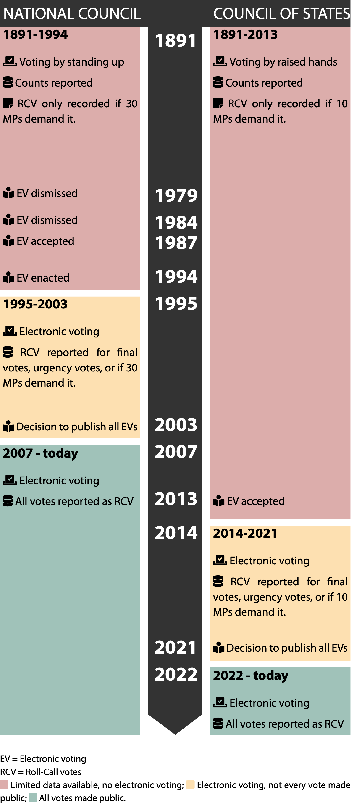

For the National Council, electronic voting was accepted in 1987 and enacted in 1994, ebbing the way for more detailed voting records. 
Before the winter session of 1995, voting records are mainly reported as aggregated counts, i.e., reporting how many members are for or against a specific proposal or proposition. 
Only if 30 MPs demanded roll-call voting, did the records reflect the names of the MPs voting for/against a proposal/proposition.
With the implementation of electronic voting, voting records became more accessible. However, at first, only final votes (Gesamt/Schlussabstimmung) were reported as roll-call votes, for the rest, aggregated vote counts were reported.
From the winter session 2007 onwards, all votes are reported as roll-call votes in the National Council.

For the Council of States it took longer to implement electronic voting (2013 accepted, spring session 2014 enacted) and slightly longer for all votes to be reported as roll-call votes (spring session 2022).

-------
## Voting records for federal enactment drafts, parliamentary initiatives (phase 2) and cantonal initiatives (phase 2)

### pre 1995 (NR) // pre 2014 (SR)

#### Entry vote

Enactment drafts generally start the debate with an introductory debate (Eintretensdebatte) after which entering the debate is voted on.
Sometimes, entry is voted on silently.

> 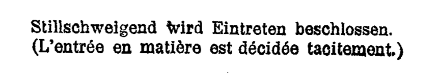
*Example of a silent vote on entering the detailed debate (1903, Document ID 20027243)*.

#### Votes on detailed propositions

In the detailed discussions of enactment drafts (originating from the federal council, parliamentary initiatives or cantonal initiatives), different propositions are debated and voted on. If a proposition is not contested (no objects), it is accepted without a vote, i.e., the president reports "Angenommen" in the Amtliches Bulletin.

Sometimes (especially prior to 1920), the votes are documented at the end of the debate. Sometimes the votes are located within the debate. When and how the votes on propositions takes place depends, in part, also on the president and how they guide the debate.

<!-- Ständerat -->
> 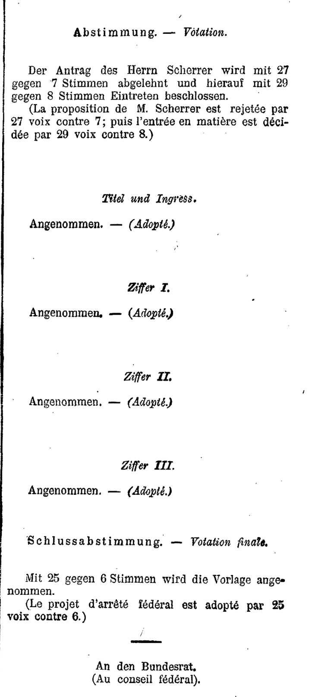
*Example of voting records in the AB on an enactment draft (including Eintretensabstimmung, detailed propositions and final vote) in 1903 (Document 20027247)*.

If there are multiple propositions for a single object (e.g., an Article), the votes are done subsequently, pitting one proposition against the other and the winner against the next open proposition.

> 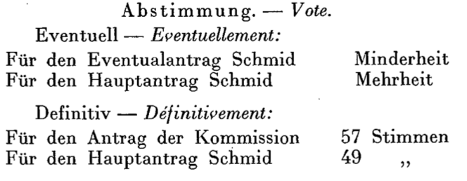
*Example of voting outcomes documented in the AB where multiple propositions are present for the same object (here, Article 2) (1933, Document ID 20031396, page 23)*.

#### Final votes

Final votes are kept secret in the AB prior to 1970 unless 30 members of the National Council (or 10 members of the Council of States) demand an open vote, i.e., a roll-call vote.

### National Council: 1995-2006 (WS95)

In the winter session 1995, electronic voting was enacted (after it passed in 1987). However, only Gesamt/Schlussabstimmungen and Dringlichkeitsabstimmungen were recorded as roll-call votes (as well as the standard rule if 30 MPs requested a roll-call vote).

#### Entry vote

Silent agreement to enter the debate are reported often in the form of `Eintreten wird ohne Gegenantrag beschlossen`. Otherwise, counts are reported.

#### Votes on detailed propositions

For most propositions, only counts are reported. 

However, for some exceptions, roll-call voting data is available (e.g., see below for an example where Rückweisungsanträge are reported as roll-call votes).

> 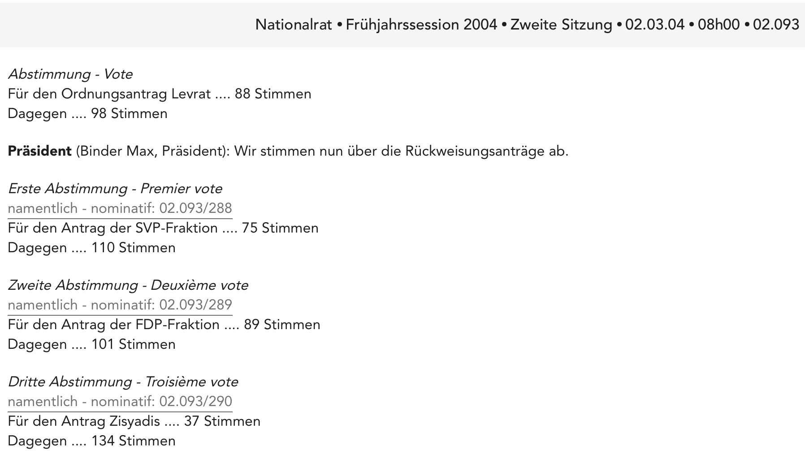
*Example of mixed records for propositions: reports of aggregated vote counts vs. roll-call votes (bill 02.093, 2004)*.

#### Final votes

All final votes are reported as roll-call votes.

### National Council: From 2007 - today

#### Entry vote

Often, entry votes are unanimous (no counter proposal). 

> 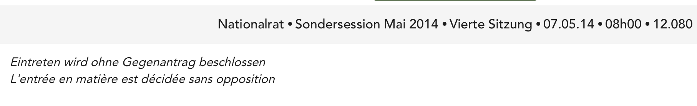
*Example of a record of an entry vote that is not contested*.

If the entry vote is contested, votes are reported as aggregated counts.

#### Votes on detailed propositions

From 2007 on, contested propositions are recorded and published as roll-call votes.

> 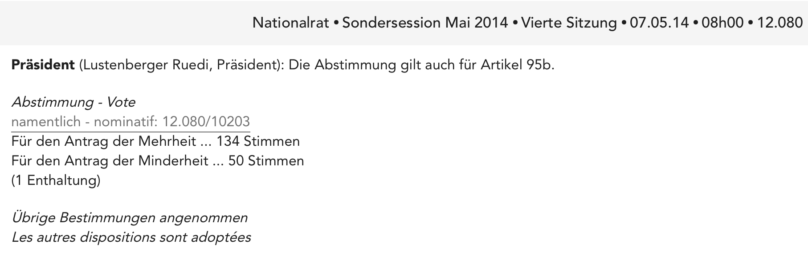
*Example of a record of an electronic vote on a proposition for bill 12.080*.

#### Final votes

Final votes are recorded and published as roll-call votes.

> 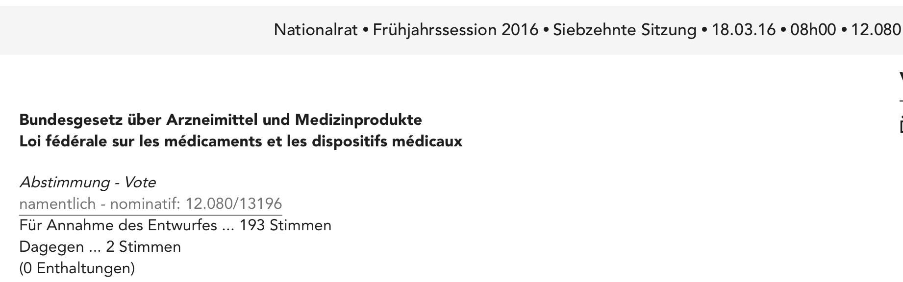
*Example of a final vote (2016, bill 12.080)*.

### Council of States: 2014 (FS14) - 2022 (FS22)

In the spring session 2014, electronic voting was enacted (after it passed in 2013) in the Council of States. However, only Gesamtabstimmungen and Schlussabstimmungen were recorded as roll-call votes (as well as the standard rule if 10 MPs requested a roll-call vote).

#### Entry vote

Entry votes are not electronically recorded, thus only outcomes are reported (e.g., `Eintreten wird ohne Gegenantrag beschlossen`).

#### Votes on detailed propositions

Similarly, only aggregated voting decisions are reported for detailed propositions.

> 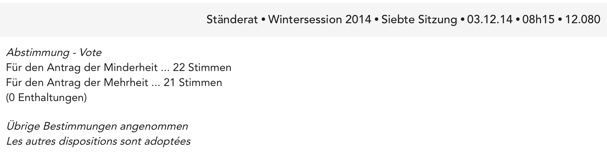
*Voting decision for proposition Art. 4 of bill 12.080 in the Council of States. Total counts are reported only.*.

#### Final votes

The final votes are reported as roll-call votes. 

> 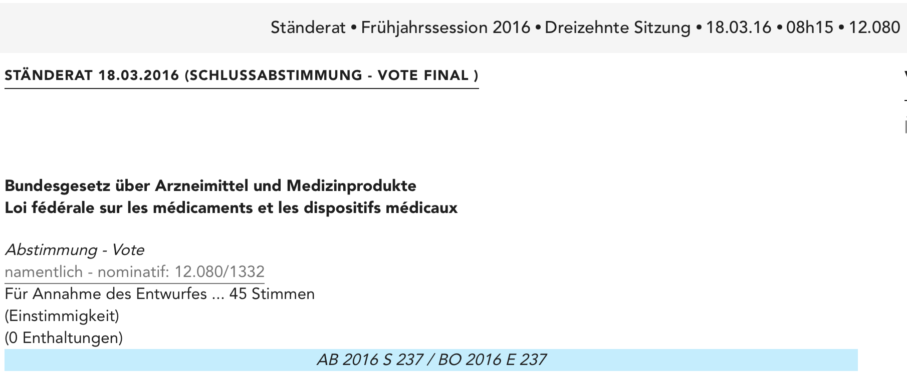
*Example of roll-call votes for the final vote on bill 12.080 in the Council of States*.

### Council of States: From 2022 (FS22) - today

From spring session 2022, all votes are reported in the Council of States (after it passed a vote in the winter session 2021).

#### Entry vote

Often `Eintreten wird ohne Gegenantrag beschlossen ` is reported.

#### Votes on detailed propositions

Whenever votes are unanimous, the short `Angenommen - Adopté` is reported. 
If votes are not unanimous, roll-call votes are reported. 

> 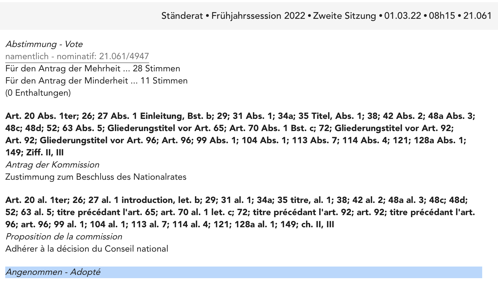
*Example of unanimous votes for propositions as well as roll-call voting outcomes in the Council of States, 2022 (bill 21.061)*.

#### Final votes

Gesamtabstimmung and Schlussabstimmung are reported as roll-call votes.

-------
## Voting records by other bill types (and years)

### ..Parliamentary Initiatives (Phase 1) and Cantonal Initiatives (Phase 1)

During the first phase of parliamentary and cantonal initiatives, the committee of the first council checks the proposal and gives a recommendation. If the committee(s) reject the proposal (nicht Folge geben/not granted or keine Zustimmung/no agreement), the first council can take up the debate and vote on it.

#### pre 1995 (NR) // pre 2014 (SR)

Votes are reported as counts.

#### National Council: 1995-2006 (WS95)

Votes are reported as counts.

#### National Council: From 2007 - today

From 2007 onwards, all electronic votes are recorded and published as roll-call votes.

> 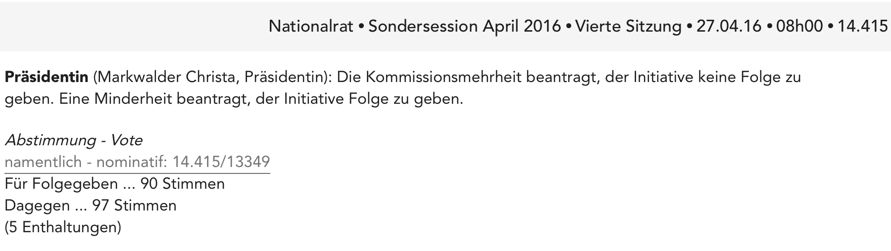
*Example of a roll-call vote on whether or not to pursue a parliamentary initiative (bill 14.415)*.

<!--voting data source: https://www.parlament.ch/de/ratsbetrieb/abstimmungen/abstimmungs-datenbank-nr?BusinessNumber=14.415 -->

#### Council of States: 2014 (FS14) - 2022 (FS22)

Votes are reported as counts.

#### Council of States: From 2022 (FS22) - today

Votes are reported as roll-call votes.

### ..Motions

#### pre 1970 (AB)

If a motion is reported in the AB prior to 1970ies (because of its relevance to a possible referenda), only the final outcome is reported in the AB.

<!-- Nationalrat -->
<!-- Example 1903---20027203.pdf
Example 1903---20027204.pdf -->
> 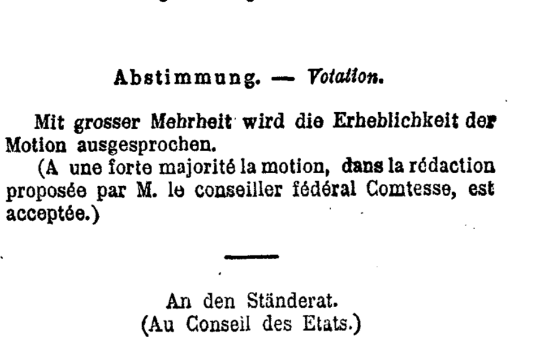
*Example Motion discussed in the National Council from 1903 (document ID 20027204, page 15)*.

This outcome is sometimes hidden in the last speech given by the president. If a Motion is not contested, then sometimes the AB only reports "Zustimmung".

> 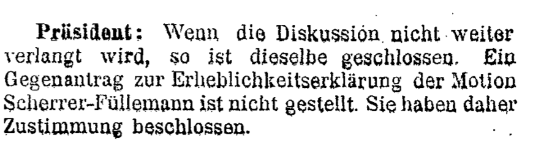
*Example of voting record in the form of a speech by the president, held in the Council of States in 1903 (document ID 20027244, page 10)*.

#### From 1971 - 2007 (NR)/2022(SR)

Motions are reported on in full in the AB after 1971. Voting decisions are often reported as counts for/against.

> 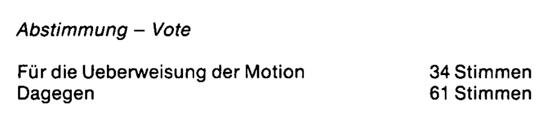
*Example of voting records on a Motion in 1986 (Document ID 2001436, page3)*.

> 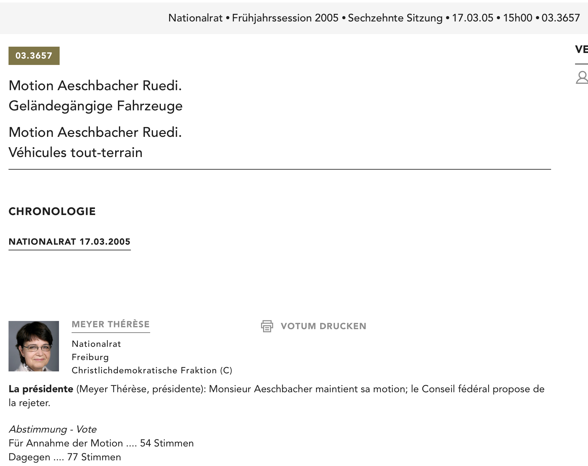
*Second example of voting records for Motion 03.3657*.

If votes are unanimous, only `angenommen` is recorded. 

> 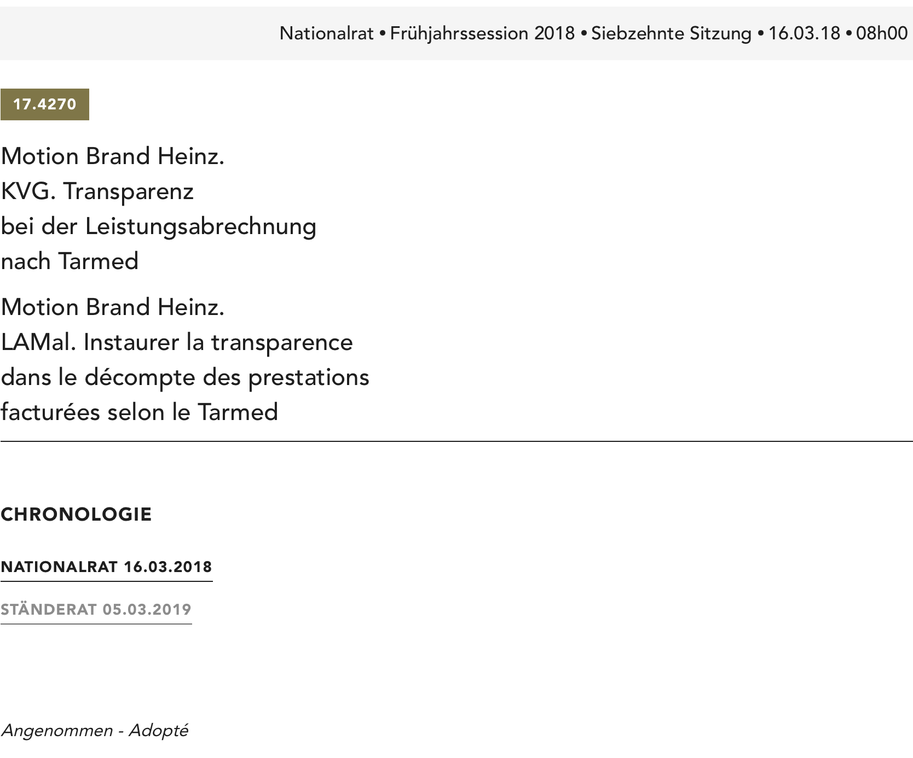
*Example of voting outcome for Motion 17.4270 in 2017*.

<!-- Motion 17.4270 has 2 entries in `BillStatus`: both Angenommen, for both chambers. (https://www.parlament.ch/de/ratsbetrieb/amtliches-bulletin/amtliches-bulletin-die-verhandlungen?SubjectId=42992) -->

<!-- Motion 03.3657 has for/aginst vote counts. https://www.parlament.ch/de/ratsbetrieb/amtliches-bulletin/amtliches-bulletin-die-verhandlungen?SubjectId=8611 -->

#### From 2007 (NR)/2022 (SR) - today

Since the publishing of all electronic votes (in 2007 for the NR, in 2022 for the SR), some motions also report full voting lists. 

> 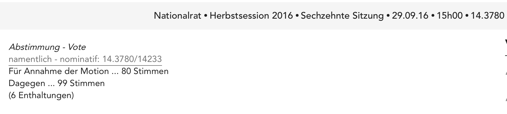
*Example of roll-call vote for Motion 14.3780 in 2016 in the National Council*.

<!-- https://www.parlament.ch/de/ratsbetrieb/amtliches-bulletin/amtliches-bulletin-die-verhandlungen?SubjectId=38379 -->

### ..Postulate

#### pre 1970 (AB)

Postulates in conjunction with bills subject to the referendum are reported in the AB. Similar to motions, often only final decisions are reported.

> 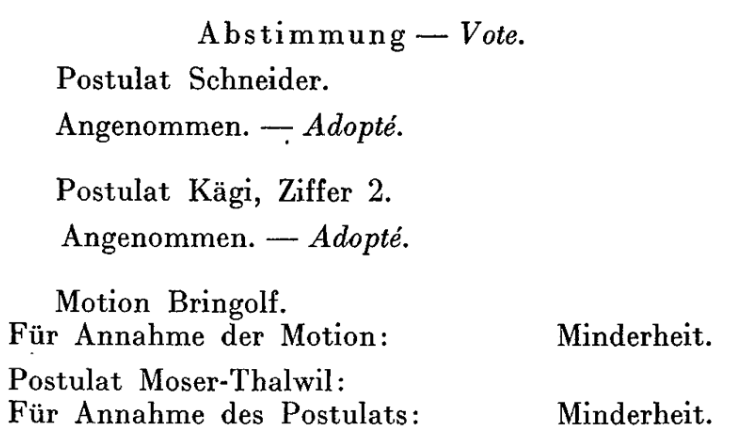
*Example of a voting decision recorded for a postulate in the AB in 1933*.

#### From 1971 - 2007 (NR)/2022(SR)

Final decisions are reported, indicating whether or not the postulate is transferred to the federal council or not.

> 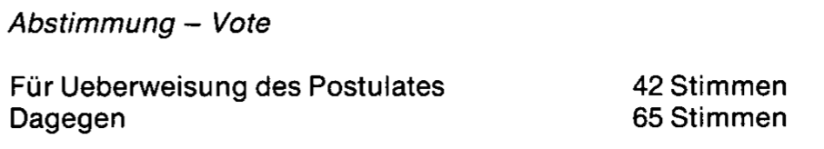
*Example of a voting decision recorded for a postulate in the AB in 1986 (Document ID 20014363, page3)*.

Here, voting decisions are often communicated without referring to a vote (unanimous decision, no objectsions). 

> 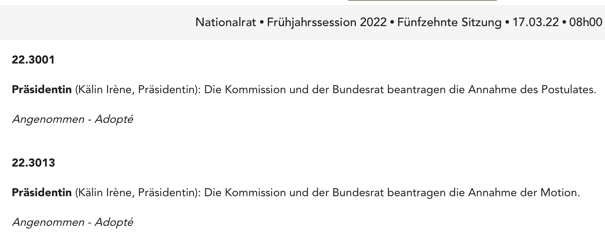
*Example of a decision recorded for postulate 22.3001 as part of a debate-cluster surrounding several bills in 2022*.

If a decision is not made unanimously, the voting outcomes are reported in the AB. These are not roll-call votes, only final counts (for/against) are reported. 

> 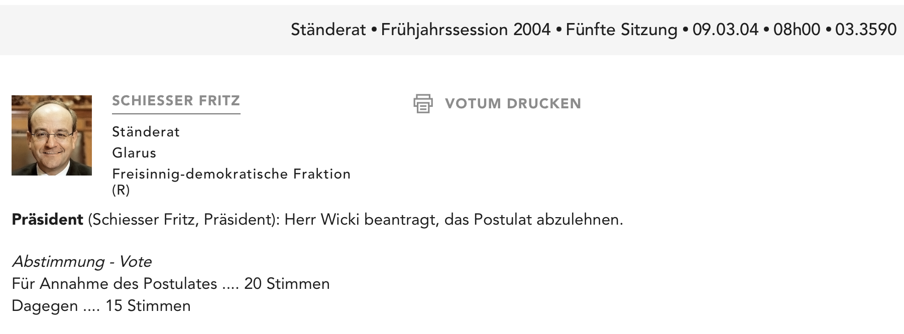
*Example of a voting decision reported for a postulate with for/against votes*.

<!-- In the onlineDB, the "final status" is recorded in `BillStatus` (png: onlineDB_postulat_annahme). -->
<!-- If a postulat (eg 21.4562) is retracted, this is recorded in `BillStatus` was well. -->
<!-- Postulat 03.3670 has 2 entries in BillStatus: The first for when the bill was "bekämpft" and a second for then the bill was forcibly retired. -->

<!-- Postulat 03.3590 has for/against counts in the votes. These are not reported in `BillStatus` (only Angenommen is reported there). I don't understand where we get this info from (for/against) other than from the transcripts. https://www.parlament.ch/de/ratsbetrieb/amtliches-bulletin/amtliches-bulletin-die-verhandlungen?SubjectId=7186 -->

#### From 2007 (NR)/2022 (SR) - today

Since the publishing of all electronic votes (in 2007 for the NR, in 2022 for the SR), some postulates also report full voting lists. 

> 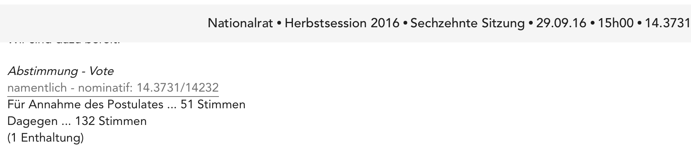
*Example of roll-call vote for Postulate 14.3731 in 2016 in the National Council*.

<!-- https://www.parlament.ch/de/ratsbetrieb/amtliches-bulletin/amtliches-bulletin-die-verhandlungen?SubjectId=38379 -->

### ..Interpellation

The Interpellation does not need a vote. However, satisfaction delcarations or requests for debate are recorded in the AB. We, thus, include the bill here for sake of completeness.

#### pre 1970 (AB)

Since Interpellations do not need a vote, the only voting decisions recorded for them are whether or not a debate should be held on the subject.

<!-- Ständerat -->
> 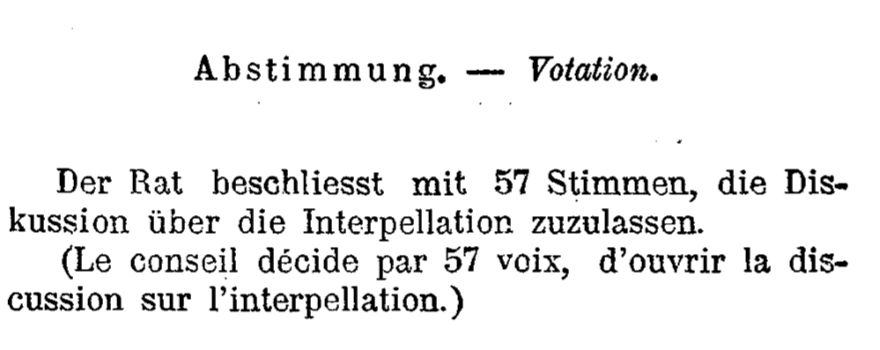
*Example Interpellation discussed in the Council of States in 1903 (document ID 20027262, page 13)*.

#### From 1970 - today

From 1971 onwards, all interpellations are recorded in the AB (not just those that tie to a bill that is subject to the referendum right). As stated before, no votes occur, however, the sponsor of the bill can declare whether or not they are satisfied with the answer (or partially satisfied).

> 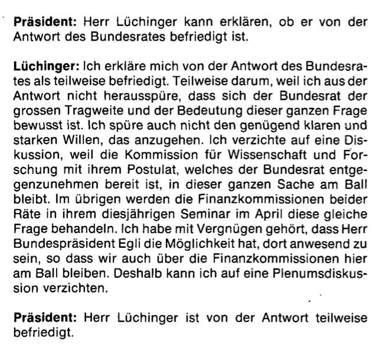
*Example of how the sponsor of the interpellation declares their satisfaction (1986_20014142_page3)*.

If the sponsor is unsatisfied, they can request a debate. 

> 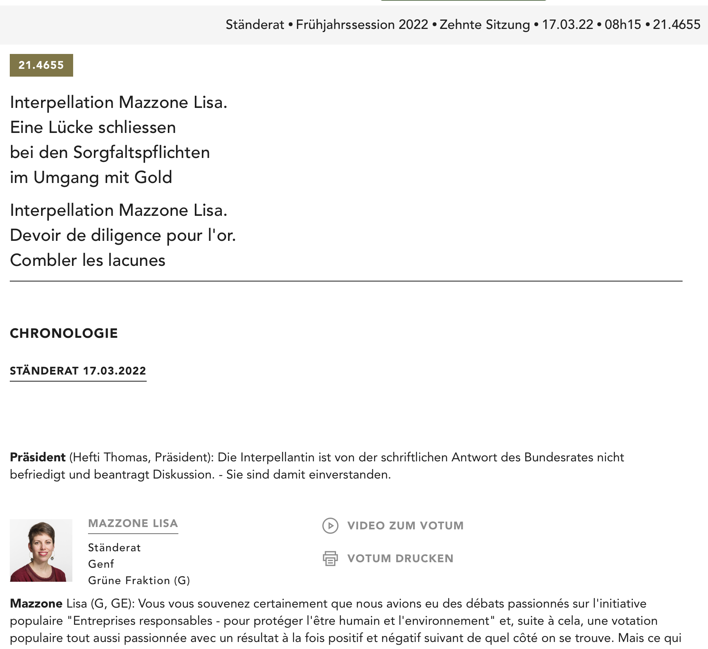
*Example of a request for a debate on bill 21.4655 in 2022*.

The interpellation is marked as `closed` with end of the debate. 

<!-- In the online database, this is recorded in the table `BillStatus` table under `StatusText` and includes the date under `Modified`. -->
<!-- (see onlineDB_Interpellation_erledigt.png) -->

### ..Anfrage, Fragestunde

The Anfrage/Fragestunde does not need a vote. We include it here for sake of completeness. The Anfrage/Fragestunde is completed with the answer of the federal council (in person or written answer).

#### pre 1970 (AB)

Prior to 1970, Questions are not reported in the AB.

#### From 1971 - today

From 1971-1995, the AB reports on all questions and answers. There are no voting decisions and the bill is closed with the answer of the federal council (either in person during question hour or in written form).

> 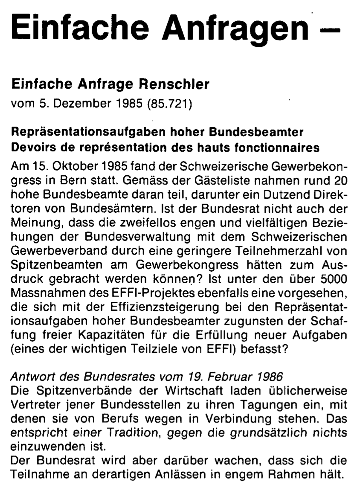
*Example of a Anfrage reported in the AB (1986, 20014253, page 1)*.

-------

## Sources (among others)

[Parlamentswörterbuch: Abstimmung unter Namensruf](https://www.parlament.ch/de/über-das-parlament/parlamentswörterbuch/parlamentswörterbuch-detail?WordId=9)

[Parlamentswörterbuch: Abstimmungsverfahren](https://www.parlament.ch/de/über-das-parlament/parlamentswörterbuch/parlamentswörterbuch-detail?WordId=54)

[Parlamentswörterbuch: Stimmabgabe in den Räten](https://www.parlament.ch/de/über-das-parlament/parlamentswörterbuch/parlamentswörterbuch-detail?WordId=476)

Traber, Denise, Simon Hug, and Pascal Sciarini. "Party unity in the Swiss Parliament: the electoral connection." The Journal of Legislative Studies 20.2 (2014): 193-215.

