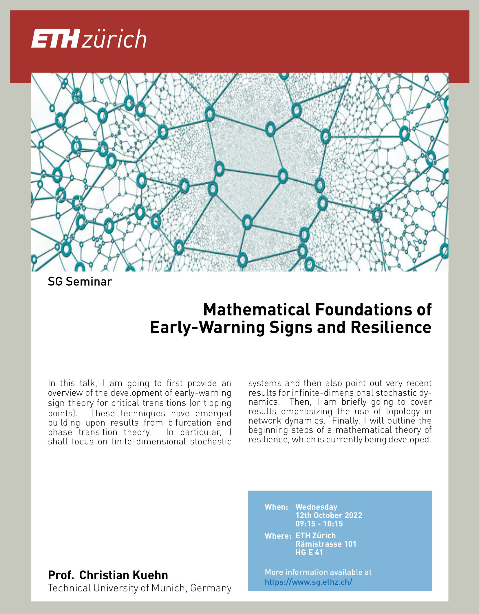

**[Prof Chrisitan Kuehn](http://www.multiscale.systems/)** from the *Technical University of Munich* will present his work on the *Mathematical Foundations of Early-Warning Signs and Resilience*.

- Date: Wednesday, 12 October 2022 at 09:15 - 10:15
- Room: HG E41

## Title: *Mathematical Foundations of Early-Warning Signs and Resilience*
Early warning signals (EWSs) are a group of statistical time-series signals which could be used to anticipate a critical transition before it is reached. EWSs are model-independent methods that have grown in popularity to support evidence of disease emergence and disease elimination.
In this talk, Prof. Kuehn is going to first provide an overview of the development of early-warning sign theory for critical transitions (or tipping points). 
These techniques have emerged building upon results from bifurcation and phase transition theory. 
In particular, the focus will be on  finite-dimensional stochastic systems and then also point out very recent results for infinite-dimensional stochastic dynamics. To conclude, Prof. Kuehn will outline the beginning steps of a mathematical theory of resilience, which is currently being developed.

