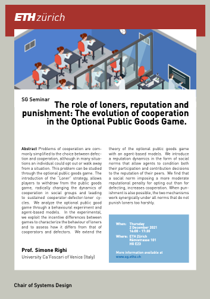

**[Prof Simone Righi](https://www.simonerighi.org/contacts)** from the *University Ca'Foscari of Venice* will present his work on *Optional Public Goods Games*.

- Date: Thursday, 2 December 2021 at 16:00 - 17:30
- Room: HG E23

## Title: *The role of loners, reputation and punishment: the evolution of cooperation in the Optional Public Goods Game*

Problems of cooperation have often been simplified to the choice between defection and cooperation, although in many situations an individual could opt out or walk away from a situation. This type of problem can be studied through the optional public goods game. The introduction of the “Loner" strategy, allows players to withdraw from the public goods game, radically changing the dynamics of cooperation in social groups and leading to a never-ending cooperator-defector-loner cycle. We analyze the optional public good game through a behavioural experiment and agent-based models. In the experimental setting, we exploit the incentive differences between games to characterize the behaviour of loners and to assess how it differs from that of cooperators and defectors. We consider all combinations of games where participation is (vs is not) mandatory and in which participant can (vs cannot) engage in pro- and anti-social punishment. We find that, when forced to play, loners contribute less than average, while behaving distinctly from defectors. Moreover, loners do not significantly change their contribution levels when the punishment institution is introduced. We then extend the theory of the optional public goods game with an agent-based models. We introduce a reputation dynamics in the form of social norms that allow agents to condition both their participation and contribution decisions to the reputation of their peers. We benchmark this setup both with respect to the standard optional public goods game and to the variant where all types of punishment are allowed. We find that a social norm imposing a more moderate reputational penalty for opting out than for defecting, increases cooperation. When, besides reputation, punishment is also possible, the two mechanisms work synergically under all norms that do not punish loners too harshly. Under this latter setup, the high levels of cooperation are sustained by conditional strategies, which largely reduce the use of pro-social punishment and almost completely eliminate anti-social punishment.

## References

- [Podder S, Pancotto F, Righi S (2021),  Reputation and punishment stabilize cooperation in the Optional Public Good,  Philosophical transactions of the Royal Society B: Biological Sciences, Volume 376, Issue 1838](http://doi.org/10.1098/rstb.2020.0293)
- [Pancotto F, Righi S, Takács K, Voluntary Play Increases Cooperation in the Presence of Punishment: A Lab in the Field Experiment.](https://ssrn.com/abstract=3908319)
- Podder S, Righi S,  Genetic Evolution of Cooperative strategies within the Optional Public Goods Game.

