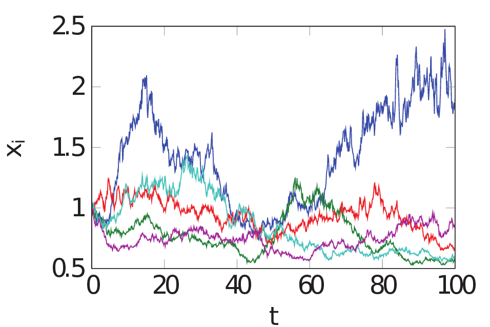

We combine the law of proportionate growth with additive growth terms, to develop an agent-based modeling framework with vast applications in social and economic systems. The paper discusses phenomena as diverse as saturated growth, competition, stochastic growth, investments in random environments, wealth redistribution, opinion dynamics and the wisdom of crowds, reputation dynamics, knowledge growth, and the combination with network dynamics. Read more [on ArXiv](https://arxiv.org/abs/1909.00653)

