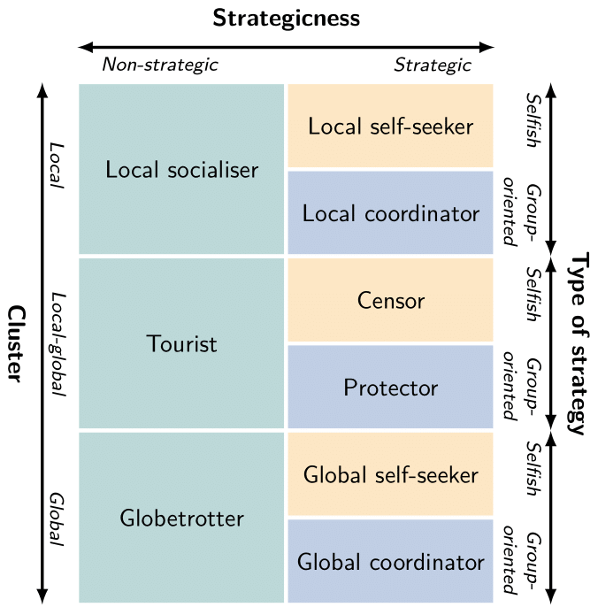

Our new paper [A new theory of social roles in networks](https://osf.io/preprints/socarxiv/xkafb/) is available now. 

Individuals fulfill different social roles in different contexts.
For example, a professor teaches in a lecture theatre and does research in the lab. 
Especially in large networks, this context is very heterogenous as local clusters form.
If these clusters are not addressed role detection yields flawed results.
We address the effect of clusters on roles in networks with a novel theory of social roles.
This theory, enables us to capture local heterogeneities in networks, interrelate roles with each other, and generalise them beyond specific case-studies.

A preprint is now available on [SocArxiv](https://osf.io/preprints/socarxiv/xkafb/).

