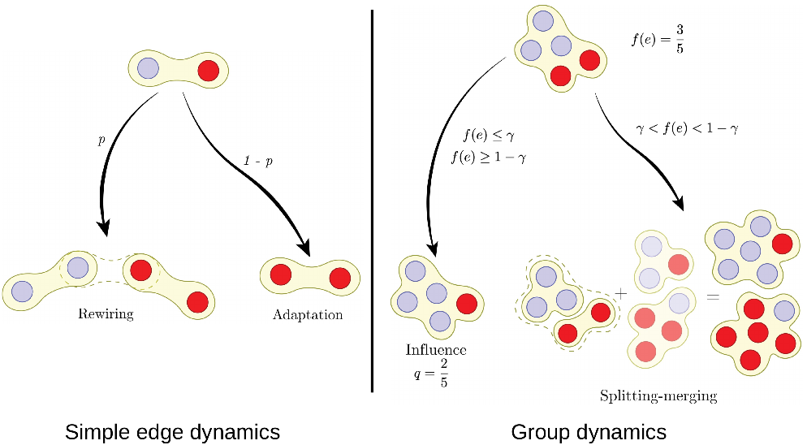

What are the effects of group interactions in opinion formation? Do they help or hamper the emergence of consensus?
We study this problem by taking a network perspective and specifically in the [adaptive voter model](https://journals.aps.org/pre/abstract/10.1103/PhysRevE.74.056108). This is a variation of the [voter model](https://en.wikipedia.org/wiki/Voter_model) where agents can either adopt the opinion of their neighbors or rewire. Here, we extend this model beyond pairwise interactions to include group interactions. For this, we depict the groups as hyperedges. We apply a Heterogeneous Mean Field approximation where the distribution of group size is determined by a parameter $\beta$. To study the effects of the groups, we calculate the [master equation](https://en.wikipedia.org/wiki/Master_equation) and we quantify the impact of the groups. After a detailed analysis, we find that group interactions accelerate the system towards total consensus where one opinion survives. We also prove that the group interactions increase the initial opinion biases, a phenomenon not observed in the classical voter models.
[Get the article here.](https://journals.aps.org/pre/abstract/10.1103/PhysRevE.105.054307)

