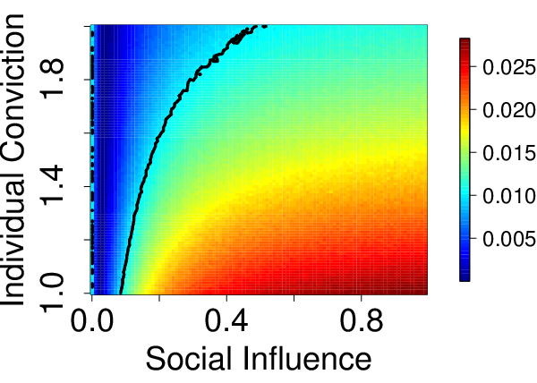

<!-- Write your content here -->

Finally, we got of our papers on the wisdom of crowds accepted: 

Enhanced or distorted wisdom of crowds? An agent-based model of opinion formation under social influence, forthcoming in: 
*Swarm Intelligence* (2021)

The ambiguous role of social influence on the wisdom of crowds: An analytic approach, in: *Physica A* (2021) 567:125624 

