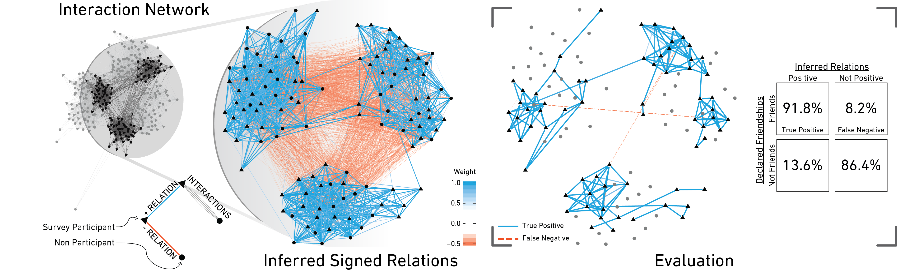

As part of [this project](/projects/signed-relations), Dr. Giacomo Vaccario and Dr. Piotr Górski are organizing a workshop satellite at CCS 2022, which takes place online and onsite in Palma de Mallorca.

# About the Satellite
According to the structural balance theory, interacting systems balance the positive and negative relations between different system elements such that local conflicts are minimized. Hence, structural imbalances induce a dynamics to resolve such conflicts. This dynamics plays a vital role in evolutionary processes because many very different final states can be reached. When the resolution of one local conflict leads to the formation of another one, metastable states can emerge, and complete balance is out of reach. When complete balance is instead attained, either state with full consensus (paradise state) or two coexisting enemy groups (polarization) crystallize.

Given the big difference in the reachable final states, we should ask: Is structural balance good or bad for a system? Does it hamper the functionality or performance of a system? Or does it improve it? Do we have the right data to answer these questions?

The aim of this Satellite is to present recent research on the open problems related to structural balance. In particular, following topics will be of interest:

- Inference of signed relations
- Evolution of signed relations and quantification of structural balance
- How performance is related to structural balance

If you eager to have answers to these questions, come to our [Satellite Workshop Signed Relations and Structural Balance](https://sites.google.com/view/relations-balance-satellite/) of [CCS 2022](https://www.ccs2022.org/).
