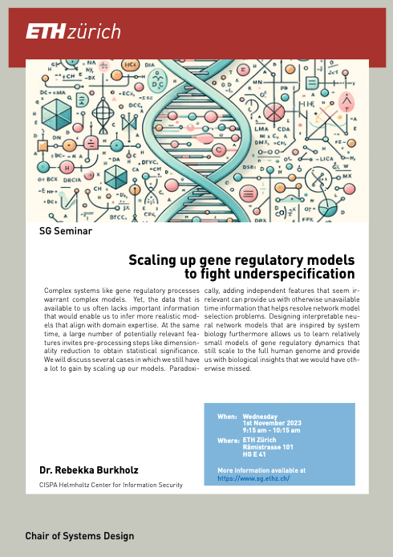

### Abstract

Complex systems like gene regulatory processes warrant complex models. Yet, the data that is available to us often lacks important information that would enable us to infer more realistic models that align with domain expertise. At the same time, a large number of potentially relevant features invites pre-processing steps like dimensionality reduction to obtain statistical significance. We will discuss several cases in which we still have a lot to gain by scaling up our models. Paradoxically, adding independent features that seem irrelevant can provide us with otherwise unavailable time information that helps resolve network model selection problems. Designing interpretable neural network models that are inspired by system biology furthermore allows us to learn relatively small models of gene regulatory dynamics that still scale to the full human genome and provide us with biological insights that we would have otherwise missed.

 
 

