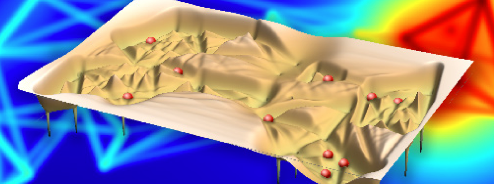

Individuals live in groups!
Their weave of dynamical and differentiated interactions results in complex societies, whose properties and ruling principles can only be fully unraveled when studying the underlying social system from a formal standpoint.

In this course, we use **agent-based modelling** as a bottom-up tool to study social systems.
Agents have internal degrees of freedom (opinions, strategies), the ability to perceive and to change their environment, and to interact with other agents.
Their (inter)actions result in collective dynamics with emergent properties that need to be analyzed and understood quantitatively.

We focus on a parsimonious description of the agent behavior which relates individual interaction rules to the dynamics on the system level, and complements engineering and machine learning approaches to modelling.

While the lectures focus on the theoretical foundations of agent-based modelling, they are illustrated on a more practical level in weekly exercise classes.

## Useful Information

- **Lecturer**: [Prof. Frank Schweitzer][prof]
- **Course ID**: [363-0543-00L][vvz]
- **Period**: Spring Semester 2022
- **Syllabus**: [PDF][syllabus-pdf]
- **Moodle**: [Moodle Board][moodle]

[syllabus-pdf]: https://www.sg.ethz.ch/media/medialibrary/2020/02/syllabusABM-22.pdf
[prof]: /team/frank_schweitzer
[teaching assistant]: /team/giacomo_vaccario
[vvz]: http://www.vvz.ethz.ch/Vorlesungsverzeichnis/lerneinheit.view?lerneinheitId=157618&semkez=2022S&ansicht=LEHRVERANSTALTUNGEN&lang=en
[moodle]: https://moodle-app2.let.ethz.ch/course/view.php?id=17211
