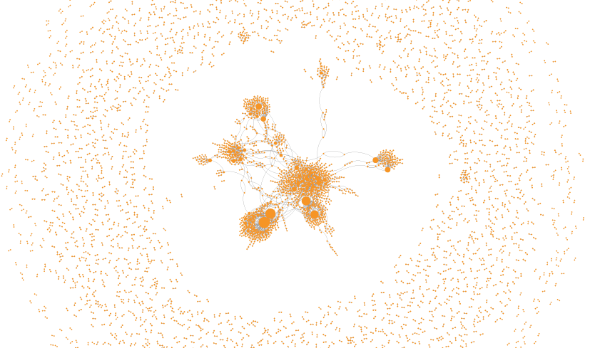

The course provides an overview of the methods and abstractions used in:

- the quantitative study of complex networks
- empirical network analysis
- the study of dynamical processes in networked systems
- the analysis of systemic risk in networked systems
- the study of network evolution
- data mining techniques for networked data sets.

## Useful Information

- **Lecturer**: [Prof. Frank Schweitzer][prof]
- **Course ID**: [363-0588-00L][vvz]
- **Period**: Spring Semester 2021
- **Syllabus**: [PDF][syllabus-pdf]
- **Moodle**: [Moodle Board][moodle]

[syllabus-pdf]: syllabus2021.pdf
[prof]: /team/frank_schweitzer
[moodle]: https://moodle-app2.let.ethz.ch/course/view.php?id=3916
[vvz]: http://www.vvz.ethz.ch/Vorlesungsverzeichnis/lerneinheit.view?lerneinheitId=135015&semkez=2020S&ansicht=KATALOGDATEN&lang=en
