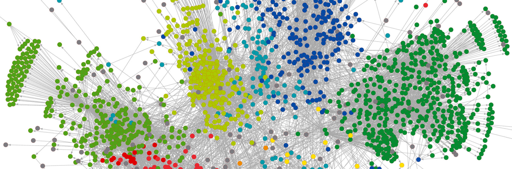

## Description

Social Data Science is an emerging field that studies human behavior and social interaction through digital traces. The revolution in measurement brought by our digital society gives us data at global scales, very high frequencies, and unprecedented levels of depth and resolution.

This course focuses both on the fundamentals and applications of Data Science in the Social Sciences, including technologies for data retrieval, processing, and analysis with the aim to derive insights that are interpretable from a wider theoretical perspective. The lectures introduce theoretical foundations and present practical examples and technologies, using the R statistical language from a literate programming perspective. Weekly exercise classes provide practical skills and discuss the solutions to exercises that build on the concepts and methods presented in the previous lectures.

Students of Social Data Science learn how to plan, execute, and interpret complete Data Science projects to address questions about human behavior. After this course, students will know how to gather data from social media, search trends, and other online and offline sources, how to process and store that data, and how to combine, analyze, and visualize data to address specific questions. The course makes a special emphasis in interpretation and critique of Data Science in the Social Sciences, aiming at an interdisciplinary approach that can inform students from various disciplines.

## Useful Information

- **Course ID**: [363-1091-00L][vvz]
- **Period**: Block course from Feb 15th to Feb 19th, Spring Semester 2021
- [Syllabus 2021](https://www.sg.ethz.ch/media/medialibrary/2021/01/Syllabus_2021.pdf)
- [Online Materials](https://dgarcia-eu.github.io/SocialDataScience/)
- [Moodle Board](https://moodle-app2.let.ethz.ch/course/view.php?id=14192)

[vvz]: http://www.vvz.ethz.ch/Vorlesungsverzeichnis/lerneinheit.view?semkez=2021S&ansicht=LEHRVERANSTALTUNGEN&lerneinheitId=150384&lang=en
