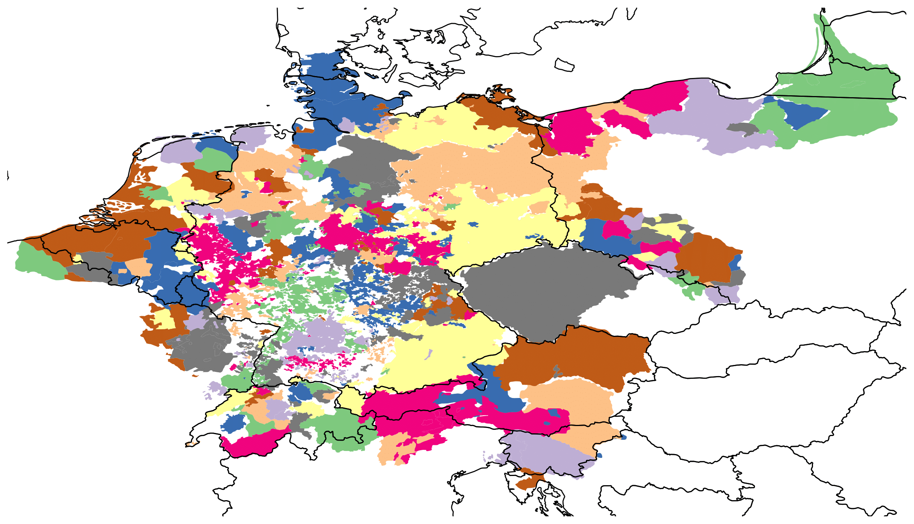

I am a Ph.D. candidate at the Chair of Systems design at ETH Zurich where I work on data-driven models of socio-historical systems.
Currently, I focus on a temporal network model of letter correspondences during the European Reformation.
I try to understand the underlying communication patterns which gave rise to the spreading of ideas at that time.
Specifically challenging in this respect are the sampling bias of the data, as not all historical artifacts are equally likely to survive over time, and capturing the temporal sequence in which historical actions occurred.
By developing statistical methods I aim to address these challenges and provide better insights into socio-historical phenomena.
Holding a Bachelor in Psychology with Cognitive Science (University of Sussex) and a Master in Computational Science (University of Amsterdam) I aim to combine these diverse backgrounds to study complex systems in an interdisciplinary manner.

# Talks
 
**Talk**: Räumliche Aspekte der Konfessionalisierung: Vektorisierte Territorien des HRR erstellen und nutzen 
**Workshop**: Geography meets Digital Humanities: Neuere Ansätze raumbezogener Modellierung 
**Venue**: University of Erlangen-Nürnberg (online) 
**Date**: March, 12-13th 2021 
<a href="data/2020-03-12_spathums.pdf">**Download slides**</a> 